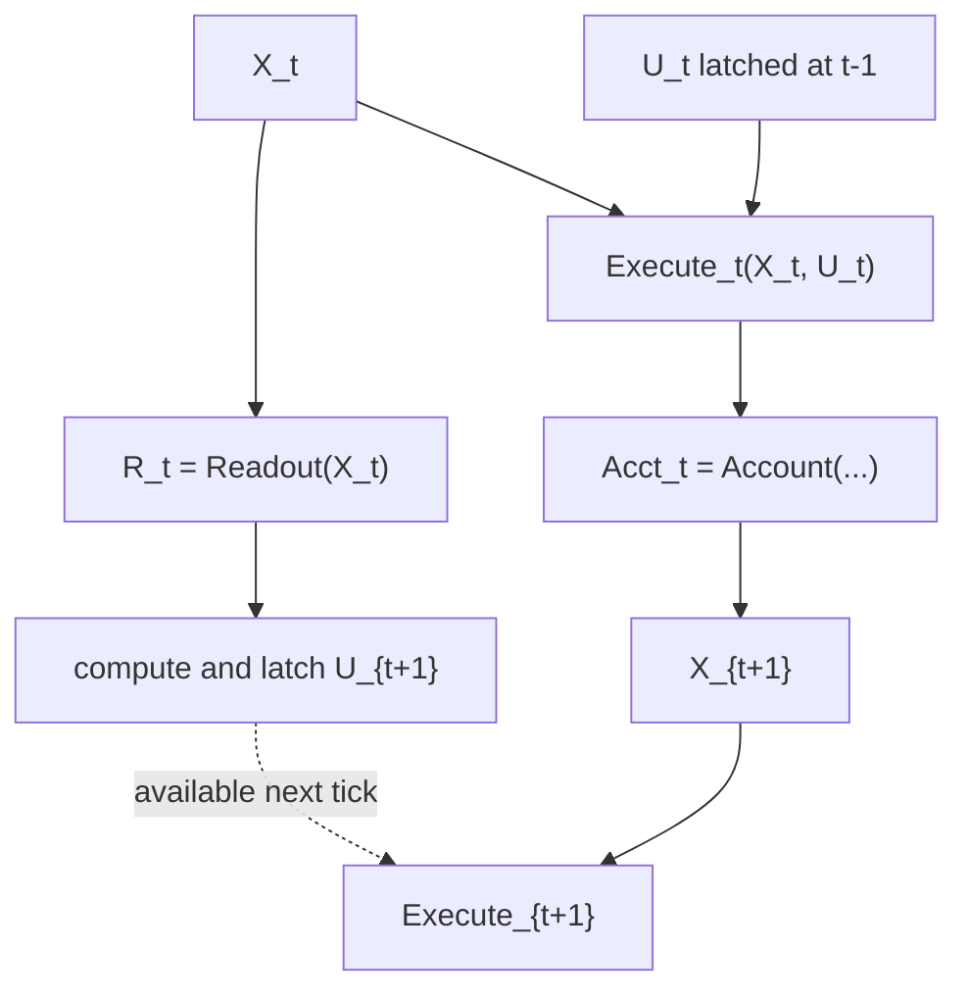

# Chapter 04 — 다음 박자에만 닿는 것들

## 대화의 형세에서 X/R/U/A까지: 권한 없는 체험이 미래의 노동을 바꾸는 경로 (2026-01-15–01-17 · archive sequence)

> 이 장은 2026년 1월 15일의 TNE 설계 해설에서 시작해, 1월 17일 RATION v0.5의 Residence Law와 3문장 규약에서 끝난다.  
> 보관 순서상 그 뒤에 이어지는 spine·skeleton·registry·socket·executable canon 제작은 다음 장에서 다룬다. 원문은 날짜만 명시하므로 아래의 상대 순서는 aggregate와 archive order를 따른다.

---

## 0. 이 장의 중심 명제

Chapter 03은 마음속에서 강하게 읽히는 값과 세계를 실제로 쓰는 권한을 갈랐다.

```text
Qualia / Story / Meaning / Alignment
≠ phys ledger
≠ feasible
≠ Select authority
≠ Commit
```

그 분리는 의미가 사실을 사칭하지 못하게 했다. 그러나 벽을 너무 완전하게 세우면 다른 문제가 생긴다.

> 느낌과 의미가 아무것도 직접 쓸 수 없다면,  
> 살아 있는 주관은 어떻게 다음 행동에 실제로 영향을 주는가?

이번 구간은 그 질문에 답하려고 앞선 문서에 흩어져 있던 경로를 처음으로 하나의 상위 제어 루프로 묶는다.

```text
다음 정책 lane:
X_t → R_t → latch U_{t+1}

현재 실행 lane:
X_t + 이전 tick에서 latch된 U_t
→ Execute_t → Acct_t → X_{t+1}
```

readout은 현재의 원장이나 선택을 같은 tick에 덮어쓰지 않는다. 대신 다음 박자에 무엇을 더 넓게 보고, 무엇을 더 깊게 비교하고, 무엇을 보류할지 바꾼다. 그 변화는 공짜가 아니며 실제 노동과 회계를 통과해야 한다.

이 장의 가장 압축된 문장은 다음과 같다.

> **읽힌 것은 현재의 사실을 쓰지 못한다.  
> 그러나 다음에 무엇을 얼마나 볼지는 바꿀 수 있다.**

따라서 이 시기의 진전은 권한의 벽을 허문 것이 아니다. 벽을 유지한 채, 벽 안쪽의 주관적 값이 미래의 탐색과 편성에 인과적으로 참여하는 통로를 만든 것이다.

```text
Influence ≠ Authority
Influence ≠ Warrant
Delay ≠ Harmlessness
Accounting ≠ Truth
```

> **[CHAPTER SYNTHESIS — CURRENT-THEORY LIMIT]** 한 tick 늦게 영향을 준다고 해서 그 영향이 사라지는 것은 아니다. 또한 영향을 실제 비용으로 청구했다고 해서 그 영향이 참이거나 정당해지는 것도 아니다. 이 구간은 원문이 허용한 **delayed causal lane**을 만들지만, 아직 evidence·attestation·claim-specific warrant를 만들지는 않는다.

---

## 1. 자료를 읽는 방법: 같은 날짜의 여러 v0.2와 보존용 aggregate를 분리한다

### 1.1 핵심 원문 약칭

| 약칭 | 원문 | 이 장에서의 역할 |
|---|---|---|
| `TNE15` | `연구/ration/0115 rationale 1` | Territory–Novelty–Edit 비규범 Annex. 이 장의 출발점 |
| `DIA16` | `연구/ration/0116 rationale go time space` | 대화=집 싸움, 증여·Episode, 시간×공간 우선순위 |
| `ALN16` | `연구/ration/0116 rationale align 1` | 정렬을 교란 뒤 회복 경사로 읽은 첫 v0.2 Draft |
| `RHY16` | `연구/ration/0116 rationale rhythm potential` | 인간=다중 루프, lock·phase slip·병목·해소 쾌감 |
| `META16` | `연구/ration/0116 rationale align2` | Alignment Meta-Law와 `R_t → Policy_{t+1}` 경로 |
| `POT17` | `연구/ration/0117 rational rhythm potential 2` | 퍼텐셜을 장력·잠금 스톡·방류 slack으로 분리 |
| `JRN17` | `연구/ration/0117 prior journal` | Priority=FrameGate, coverage, flow, 소설가→기자 교정 |
| `TOP17` | `연구/ration/0117 상위 이론 관점` | X/R/U/회계 루프, coverage update, signature/policy 초안 |
| `U17` | `연구/toone/0117 part2 통합 1` | v5.2.9U 통합 커널과 7i/7L/9a/9b 재수록 |
| `R04` | `연구/toone/0117 rationale 통합` | RATION v0.4. 지연 제어 루프와 work-coupled coverage |
| `R05` | `연구/toone/0117 rationale05 통합용1` | RATION v0.5. X/R/U/A Residence Law와 위반 규약 |
| `F17` | `연구/toone/0117 full.txt` | 이전 canon + U17 + R05를 한데 묶은 이 장의 종점 aggregate |
| `FULL15` | `연구/PARADIM/full` | 비교 지층. Story add-only·candidate expansion branch |
| `UL15` | `연구/PARADIM/0115 최상위 린터 ` | 비교 지층. UL Manifest·ValueId·DepsClosure·ULGATE branch |
| `IE15` | `연구/PARADIM/0115 대화 이론 2` | 비교 지층. TurnDebt·Episode ArcLedger branch |

### 1.2 실제 append 순서

`ration/full`은 독립적인 새 이론이 아니다. 다음 네 문서를 byte-for-byte 순서대로 붙인 보존본이다.

```text
DIA16  →  ALN16  →  RHY16  →  META16
```

행 기준으로는 다음과 같다.

| `ration/full` 범위 | 원본 |
|---|---|
| L1–217 | `DIA16` 전체 |
| L218–373 | `ALN16` 전체 |
| L374–569 | `RHY16` 전체 |
| L570–696 | `META16` 전체 |

`ration/full2.txt`는 위 696행 뒤에 `POT17` 176행과 `JRN17` 226행을 그대로 덧붙인 aggregate다.

```text
DIA16 → ALN16 → RHY16 → META16 → POT17 → JRN17
```

따라서 `full`과 `full2`를 별도 증거로 중복 계상하지 않는다. `ALN16`과 `RHY16`은 둘 다 v0.2를 표방하지만 하나가 다른 하나를 대체한 판이 아니다. aggregate 내부에서 연속되는 **서로 다른 v0.2 문서**다.

`TNE15`는 이 aggregate에 들어 있지 않다. 그러나 내부 작성일이 1월 15일이고, 다음 날 `DIA16`이 그 세 축과 대표 현상을 문언상 다시 전개하므로 별도 선행 지층으로 둔다. 두 문서가 명시적인 상속 선언을 하지는 않으므로 관계 강도는 **강한 문언·문제 연속성**으로 제한한다.

또 `TNE15`도 자기 버전을 `v5.2.9c`라고 부른다. 같은 버전명은 `PARADIM/full` 안의 Story Expansion, Story Candidate Seal, Notation Spine에도 재사용된다. 따라서 이 장에서 `9c`라고만 쓰지 않고 반드시 `TNE rationale` 또는 `Story add-only branch`처럼 제목을 함께 적는다.

1월 17일의 통합 관계는 다음과 같다.

- `TOP17`은 후속 통합본에 그대로 append되지 않은 초안·대화 지층이다.
- `R04`는 그 재료를 다시 쓴 v0.4 통합본이다.
- `R05`는 거주지 법과 위반 규약을 보강한 v0.5 rewrite다.
- `F17:L1006–2055`는 `U17`의 본문을 재수록한다.
- `F17:L2056–2394`는 `R05`를 재수록한다.
- 최종 aggregate에는 v0.4가 아니라 v0.5만 들어간다.

### 1.3 이번 장의 종료선

1월 17일 archive의 후속 구간에는 `통합을 위한 공장`의 spine·skeleton·manifest·socket·key registry가 시작되고, 그 뒤 `공장2/0117 canon05 1`의 executable STG가 나온다. 그것들은 RATION의 철학적 통합을 실제 모듈 계약으로 컴파일하는 별도 국면이다.

이번 장은 `R05`의 다음 문장들에서 닫는다.

```text
새 개념의 거주지는 X/R/U/A 중 어디인가?
tick t에서 t+1로 어떻게만 영향을 주는가?
그 결과는 어디에 반드시 청구되는가?
```

`[R05:L332–338]`

### 1.4 서술 표지

| 표지 | 지위 |
|---|---|
| 무표지 + 원문 위치 | 원문에서 직접 복원한 정의·변화·충돌 |
| `[CHAPTER SYNTHESIS]` | 여러 원문을 이 장에서 묶어 읽은 해석 |
| `[LINEAGE]` | 앞·뒤 이론과의 계보 판정. 동일성 강도는 별도 명시 |
| `[RESIDUE]` | 형식화 과정에서 약해지거나 사라진 인간적 뉘앙스 |
| `[BRIDGE-*]` | 원문에는 완성된 공리로 없으며 이번 독해에서 생긴 가설 |
| `[OPEN]` | 다음 지층에서 확인할 문제 |

원문의 `Mdot`, `\dot M`, `ṁ`는 모두 MeaningFlux 계열 표기다. 이 장의 prose에서는 `MeaningFlux`로 통일하고, 원문 집합이나 식을 재현할 때만 해당 표기를 보존한다.

---

## 2. 1월 15일 지층: 대화를 성격이 아니라 ‘다음 수의 공간’으로 읽다

### 2.1 철학을 보존하기 위한 비규범 Annex

`TNE15`는 자신을 처음부터 non-normative·view-only 문서로 제한한다. SSOT·Quench·원장·feasible·계수·limiter를 바꾸지 않으며, “설명은 권한이 아니다”라는 문장을 앞세운다 `[TNE15:L17–21, L83–89]`.

이 문서가 생긴 이유는 수식과 lint가 늘수록 “왜 이렇게 봉인했는가”가 사라지는 문제였다. 대화를 감정·성격의 목록이 아니라 다음 세 요소로 읽으려 한다.

```text
형세: 다음에 가능한 수의 공간
노동: 비교·수리·재표현 요구량
편집압: 열린 Episode가 다음 장면에 미치는 압력
```

`[TNE15:L25–30]`

즉 이 문서는 새 writer를 추가하는 이론이 아니라, 기존 봉인 아래에서 인간적 상호작용을 다시 읽기 위한 **의도 보존층**이다.

### 2.2 Territory: 자기 경계가 아니라 안전하게 둘 수 있는 다음 수 공간

Territory의 원래 직관은 “내가 안전하게 둘 수 있는 다음 수의 공간”이다. 집이 넓으면 방어적으로 움직일 수 있고, 집이 부족하면 공격적으로 확보하려 한다. 엔진 언어로는 Cand·ρ·Tube·Range-tube·CacheSpan 같은 가능성 기하와 연결되지만, 목표함수나 선택 권한으로 승격되지는 않는다 `[TNE15:L50–62]`.

> **[CHAPTER SYNTHESIS]** Territory는 물리적 피부도, 정신적 자기 경계도 아니다. 이 시점의 Territory는 **사회적 장에서 감당 가능한 후속 분기의 여유**다.

이 구분은 Interchapter Note 03-A의 자기 경계 논의와 혼합하지 않기 위해 중요하다.

```text
Territory     : 이 상호작용에서 안전하게 둘 수 있는 다음 수
Coverage      : 현재 프레임이 도달해 처리할 수 있는 범위
Self-boundary : 누구의 미래·손상·연속성을 ‘나의 유지’에 포함하는가
```

첫 두 항은 이번 장에 직접 나온다. 세 번째는 아직 나오지 않는다.

### 2.3 Novelty: 새로움은 보너스가 아니라 노동 청구다

Novelty는 감정 라벨이 아니라 `ΔQ⊥`, clock mismatch `ε`, agitation `J`가 만드는 비교·재표현 요구다. 미결정과 불일치는 공짜로 사라지지 않으며, 누군가의 노동으로 결제된다는 문장이 중심에 놓인다 `[TNE15:L63–71]`.

이 관점에서 대화의 한 수는 정보를 전달하는 데서 끝나지 않는다. 상대의 후보 공간을 늘리고, 이전 프레임으로 설명할 수 없는 잔차를 만들고, 누가 언제 그 잔차를 수리할지를 바꾼다.

### 2.4 Edit: Episode는 현재 선택을 명령하지 않지만 다음 노동을 굽힌다

Edit은 열린 아크와 StoryField·MeaningFlux가 만드는 Episode 정합성 압력이다. 사람은 자기 인생의 주인공이자 저자·독자라는 감각을 가지며, 대화의 호의·갈등·약속은 장면보다 긴 Episode에 흔적을 남긴다 `[TNE15:L73–80]`.

그러나 Edit에는 현재 선택을 강제할 권한이 없다. 허용되는 효과는 next-tick 후보 재배치, 해상도, 스캔 노동의 변화뿐이다.

```text
Episode pressure
≠ current Select command
≠ Commit authority
→ next-tick attention / comparison pressure
```

아직 이 경로가 함수로 닫히지는 않았지만, Chapter 04 전체를 끌고 갈 방향은 이미 여기 있다.

### 2.5 사회적 행동은 비용의 발생보다 비용의 분배를 바꾼다

`TNE15`는 질문·유머·침묵·사과·관계 단절을 서로 다른 비용 분배 방식으로 읽는다.

- 질문이나 지시는 상대에게 후보 생성과 정합성 노동을 호출할 수 있다.
- 유머는 통제된 잔차 뒤에 공유 프레임을 제공해 수리 방식과 분배를 바꾼다.
- 침묵은 정보 0이 아니라 의도 후보와 응답 의무를 늘릴 수 있다.
- 빠른 사과는 공격 표면을 줄이고 열린 아크의 방향을 닫는다.
- 열린 아크가 포화되면 새로운 입력을 처리할 여유가 사라져 보호적 컷이 생길 수 있다 `[TNE15:L116–143]`.

여기서 중요한 것은 “좋은 상호작용은 비용이 없다”가 아니다. 비용의 형태·시점·주체가 달라진다 `[TNE15:L125–128]`.

> **[LINEAGE — STRONG PROBLEM PRECURSOR]** Chapter 01의 “공짜 소거 금지”와 Chapter 02의 `Persistence ≠ Authority`가 사회적 노동의 언어로 다시 나타난다. 원문이 이 직접 계보를 선언하지는 않는다.

---

## 3. 1월 16일 첫 RATION: 집 싸움, 증여, Episode 마감이 한 프레임에 모이다

### 3.1 대화는 서로의 다음 수 공간을 굽히는 게임이다

`DIA16`은 RATION v0.1에서 TNE15의 Territory·집 부족·다음 수 공간 문제틀을 문언상 다시 전개한다. 다만 TNE15를 원천으로 지목하지 않으므로 형식 상속이 아니라 **강한 문언·문제 연속성**으로 판정한다. 대화는 바둑처럼 한 수가 뒤의 수 공간을 바꾸는 게임이며, 집이 있으면 방어적으로 움직일 수 있고 집이 부족하면 확보를 위해 공격적으로 움직일 수 있다 `[DIA16:L21–42]`.

협동 관계에서는 공동 Anchor와 CacheSpan을 만들 수 있고, 경쟁 관계에서는 한쪽의 수가 다른 쪽의 비교 부담을 늘릴 수 있다. 상대가 공격을 받아주며 자기 집 일부를 내어주는 행동은 고위험 동맹 제안으로 해석된다.

하지만 “집 공유”는 동일한 마음이나 공동 권한을 뜻하지 않는다. `DIA16`도 100% 같은 집을 공유한다고 보지 않는다 `[DIA16:L38–42]`.

```text
Shared Anchor
≠ shared mind
≠ shared Narrative
≠ shared Authority
```

### 3.2 증여는 물건 이전보다 Episode에 남기는 편집압이다

이 시기의 증여는 Scene보다 Episode에서 강하게 작동한다.

- 사람은 자기 인생의 주인공·저자·독자라는 감각을 갖는다.
- 누군가의 증여를 외면하면 자기 서사에서 복선을 회수하지 못했다는 압력이 생길 수 있다.
- 수여자는 행위를 통해 상대 Episode에 큰 족적을 남긴다.
- 부채·음의 의미·역행도 같은 Episode 창에서 누적되고 회수될 수 있다 `[DIA16:L56–65]`.

이 모델은 왜 선물이 권력으로 바뀔 수 있는지를 잘 포착한다. 선물은 단순 자산 이전이 아니라 상대의 미래 편집 노동을 호출할 수 있기 때문이다.

그러나 여기에는 반드시 봉인이 하나 더 필요하다.

> **[CHAPTER SYNTHESIS]** Episode에 압력이 생겼다는 사실은 영향의 발생을 설명한다. 그것이 수여자의 정당한 청구권이나 상대의 복종 의무를 자동 발급하지는 않는다.

```text
Gift creates influence / salience / open arc
≠ Gift creates unlimited authority
≠ Felt debt proves a valid obligation
```

이 구분이 없으면 사랑·호의·책임·부채·통제권이 다시 한 축으로 뭉친다.

### 3.3 우선순위의 첫 형태는 시간과 현실 거리의 합성이다

`DIA16`은 이성을 바둑돌을 놓는 행위자로 두고, 판단이 시간·공간·상호작용을 감안한다고 말한다. 특히 생각 대상과의 현실 거리가 우선순위를 바꾸며, 공간을 시간과 따로 떼어 볼 수 없다고 한다 `[DIA16:L68–74]`.

여기서는 아직 `FrameGate`나 coverage가 없다. 시간은 뒤에서 Episode 회수기한으로, 공간은 물리 거리·coverage·편집 거리로 분화한다. 그러므로 후대 정의를 이 문장에 소급하지 않는다.

### 3.4 Love–Vitality–Surface–Commit: 인간을 노동 기계로 만들지 않으려는 재독해

`DIA16`은 같은 엔진을 Love·Vitality·Surface·Commit의 네 관점으로 읽는다.

- Love는 자기조정 마찰이 낮은 형상이다.
- Vitality는 저장량보다 흐름이 나오는 능력과 리듬이다.
- Surface `Φ`는 촉감 UI다.
- Commit은 실제로 남는 책임과 현실성이다 `[DIA16:L168–179]`.

이 구분의 목적은 비용을 인간의 본질로 만들지 않는 데 있다. Spend는 마법을 막는 회계이고, 인간적인 내용은 형상·항해·흐름·남김에 있다.

> **[RESIDUE]** 후속 X/R/U/A 통합은 회계와 권한을 더 선명하게 만들지만, “형상에 맞춰 조율하고 촉감으로 항해하며 무엇을 남기는 존재”라는 문장은 점차 사라진다.

---

## 4. 1월 16일 정렬·리듬 지층: 인간을 다중 루프로 보고 정렬을 ‘복귀’에서 ‘리듬’으로 옮기다

### 4.1 정렬의 첫 정의: 정답이 아니라 교란 뒤 회복 경사

`ALN16`은 인간을 불확실한 외부 변화에 의해 리듬이 흔들리는 루프 존재로 본다. 강함·의미·발전은 흔들림이 없는 상태보다 리듬을 되찾는 과정에서 나타난다 `[ALN16:L6–13]`.

정렬은 SSOT를 쓰는 권한이 아니다. 다음 tick의 후보·표현·스캔 노동을 어느 방향으로 수렴시킬지를 나타내는 편집·노동 분배의 경사다 `[ALN16:L17–25]`.

```text
Alignment
≠ truth agreement
≠ moral correctness
≠ current writer
= recovery direction for future work
```

이 시점의 정렬은 주로 교란 이전의 안정된 루프로 돌아가는 복귀에 가깝다. 다음 날에는 완전 안정이 권태를 만든다는 반례를 만나 긴장–변화–해소의 조율로 넓어진다.

### 4.2 Episode에서 굳는다는 말과 권한 Commit은 다르다

`ALN16`은 정렬 회복이 Scene의 기분 변화가 아니라 Episode 창에서 복선 회수·채무 정리·아크 진행으로 “커밋될 때” 의미가 된다고 쓴다. 증여와 호의는 회수기한·마감·책임 창에 끼어들고, StoryField와 MeaningFlux는 그 굳음을 읽는 readout이 된다 `[ALN16:L86–98]`.

그러나 같은 문서는 실제 Authority/Commit을 phys·원장에 고정한다 `[ALN16:L101–113]`.

> **[TERM OVERLOAD]** 앞 문장의 commit은 “서사적으로 굳음”이라는 비유다. Commit writer의 SSOT 전이와 같은 타입이 아니다.

> **[CURRENT-THEORY SCOPE AUDIT]** 이 RATION에는 Episode writer, Narrative 승격 게이트, 장기 정체성 갱신 계약이 없다. Episode는 저장·상환 schema보다 **압력과 해석의 창**이다.

### 4.3 인간=다중 루프, 리듬=완료 펄스의 배분 좌표

`RHY16`은 인간을 주의·비교·결정·회복이 맞물린 다중 루프 시스템으로 놓는다. 리듬은 음악적 분위기가 아니라 에너지를 언제, 얼마나 배분할지 정하는 위상·주기·완료 기준좌표다 `[RHY16:L22–49]`.

lock은 내용의 옳음이 아니다. 스캔→비교→결정→회복의 순환에서 완료 펄스가 제때 찍혀 다음 단계로 넘어가는 타이밍 합치다 `[RHY16:L53–61]`.

급박함은 세 요구를 동시에 올린다.

```text
더 자주 넘겨라
더 강한 신호만 통과시켜라
덜 기다려라
```

이들이 정렬되지 않으면 앞단은 너무 빨리 던지고, 중단에는 미처리가 쌓이며, 후단은 근거가 미완료인 채 결정 압력을 받는다. 회복 창이 사라지고 완료 펄스가 밀리면서 phase slip이 난다 `[RHY16:L63–81]`.

### 4.4 scheduler와 readout이 한 단어 안에서 충돌하다

`RHY16`은 리듬을 배분 기준좌표·스케줄러라고 부른다. 그러나 뒤의 `META16`은 리듬·정렬 신호를 모두 readout으로 낮추고 실제 배분은 `Policy_{t+1}`만 수행하게 한다.

안전한 구분은 다음과 같다.

```text
Rhythm readout : 완료·위상·동요가 어떤 상태인지 읽는 기준좌표
Policy         : 다음 tick의 폭·해상도·예산을 실제로 배분하는 운영기
```

> **[CHAPTER SYNTHESIS — FUNCTIONAL CORRECTION]** 두 문서를 함께 읽으면 리듬은 “배분을 설명하는 좌표”에서 “배분 상태를 읽는 계기판”으로 권한이 축소된다. 명시적 폐기 선언은 아니다.

### 4.5 병목과 해소 쾌감의 첫 가설

`RHY16`은 병목을 “퍼텐셜 에너지가 할당·예열되었지만 완료·전이 경로가 열리지 못해 누적된 상태”로 정의한다. 외면은 인지적 태도를 바꿀 뿐 막힌 잔고를 자동으로 줄이지 못하고, 오히려 유지비를 더할 수 있다 `[RHY16:L85–102]`.

병목이 풀릴 때의 시원함과 기운은 잠재의 절대량보다 감소율에 민감하다는 가설도 나온다.

```text
Relief ≈ -dPE/dt
```

`[RHY16:L104–110, L151–165]`

이 가설은 체험을 잘 포착하지만, 이때의 `PE`는 아직 하나의 안정된 물리 타입이 아니다. 실제 잠금 스톡, 제약 장력, 사용하지 않은 출력 여지가 한 단어에 섞여 있다. 다음 날 첫 교정이 바로 이 혼합을 푸는 일이다.

---

## 5. 1월 16일 후속 지층: readout에 ‘다음 박자’라는 유일한 출구를 주다

### 5.1 Alignment Meta-Law의 네 봉인

`META16`은 흩어진 정렬·리듬·마찰 신호를 `R_t`로 묶고 네 공리를 둔다.

1. 정렬 readout은 SSOT·phys·ledger·feasible·Quench·계수·Δmax를 직접 바꾸지 못한다.
2. 정렬 입력은 결정론적 readout이며 SSOT write가 아니다.
3. 허용되는 영향은 다음 tick 노동 배분을 통한 경로뿐이다.
4. `R_t`는 `Policy_t`가 아니라 `Policy_{t+1}`에만 들어간다 `[META16:L13–18]`.

정렬 readout에는 제약 장력, 리듬 오차, 서사 방향과 의미유량이 함께 들어간다 `[META16:L22–34]`.

```text
R_t
= {p, λ, Λ, ξ, ε, J, τ_static, s, H, π, align, ṁ, ...}
```

### 5.2 정렬법의 영향 통로를 한 곳에 묶다

허용 출력은 다음 tick의 운영 노브다.

- 후보 폭 `k_{t+1}`
- 재표현 해상도 `ρ_{t+1}`
- scan/compare budget
- 후보 재정렬 힌트
- 창 억제·확대 `[META16:L66–86]`

이로써 Chapter 03의 “읽히지만 쓰지 못하는 것”은 완전히 무력한 장식이 아니게 된다.

```text
R_t
→ latch Policy_{t+1}
→ next-tick Search/Work_{t+1}
→ Spend_{t+1}
```

> **[CHAPTER SYNTHESIS]** 앞선 Story·TNE에 흩어져 있던 delayed influence를 정렬 readout 전체의 allowlist로 묶는다. readout이 권한을 얻은 것이 아니라, 권한 없는 제안이 미래의 노동 배분에 참여하는 경로를 얻었다.

### 5.3 UL을 계승한 것이 아니라 Closure branch를 다시 컴파일했다

이 구조는 Chapter 03의 Universal Linter와 닮았지만 직접 계보는 아니다.

- `DIA16`은 자신의 직접 원천으로 v5.2.9a와 v5.2.7L을 든다 `[DIA16:L13–17]`.
- `META16`은 Closure·One-Wall·anti-discount·same-tick 규율을 정렬법 자체에 넣는다 `[META16:L6–18]`.
- `UL15`의 직접 구조는 Attr/Source universe, ValueId dependency closure, trace graph, ULGATE다 `[UL15:L62–85, L219–276, L320–388]`.
- 1월 17일 RATION·toone 묶음에는 `ULGATE`, `AttrUniverse`, `SourceUniverse`, UL의 대문자 formal label인 `READOUT_ONLY`가 등장하지 않는다. 소문자 일반 규율 `readout-only` 자체는 분명히 존재한다.

따라서 정확한 계보는 다음과 같다.

```text
DIA16 : 9a + 7L                     [명시 원천]
META16: Closure / One-Wall 규율     [9b 버전명은 미기재]
U17   : 7i + 7L + 9a + 9b          [명시 source set, 9b 우선]
→ RATION X/R/U/A의 통합 문맥

UL15  ║ 평행한 구조적 유비 — 상속 화살표 없음
```

> **[LINEAGE — STRUCTURAL ANALOGY, NOT DIRECT INHERITANCE]** RATION은 UL의 transitive provenance wall을 가져오지 않았다. Closure 계열의 권한 분리를 지연 제어 경로로 다시 컴파일했다.

### 5.4 `[CHAPTER SYNTHESIS — FINITE-SEARCH AUDIT]` ‘What을 못 바꾼다’는 문장은 그대로는 성립하지 않는다

`META16`은 `R_t`가 결정의 What을 바꾸지 못하고 How hard/wide/deep만 바꾼다고 선언한다 `[META16:L32–34]`.

그러나 유한 탐색에서 후보 폭, 해상도, 순서, 스캔 예산, 창 억제는 발견되는 후보 집합 자체를 바꾼다. 직접 Select writer가 아니어도 최종 결과에 causal influence를 줄 수 있다.

```text
No direct selection authority
does not imply
No influence on discovered candidates
```

perm-invariance는 이미 주어진 같은 후보 집합의 열거 순서 의존성을 막는다. 어느 후보가 탐색되어 집합에 들어왔는지는 별도의 search provenance 문제다.

> **[OPEN]** RATION은 `Influence ≠ Authority`를 구현하기 시작하지만, 그 영향이 어느 후보의 발견과 선택에 실제로 기여했는지 기록하지 않는다.

### 5.5 이 단계의 성과와 아직 없는 것

생긴 것:

- readout의 허용 영향 lane
- 한 tick 지연
- 운영 노브 allowlist
- 비용 상쇄 금지
- 같은 tick의 자기확증 루프 차단

아직 없는 것:

- readout→policy dependency provenance
- policy가 만든 후보와 선택 결과의 영향 기록
- 외부 관측 결과의 evidence/attestation
- 특정 claim과 특정 application을 묶는 warrant

따라서 이 통로는 **인과 통로**이지 **진실 승격 통로**가 아니다.

---

## 6. 1월 17일 첫 지층: 하나의 퍼텐셜을 세 해석 자리로 가르다

### 6.1 장력, 잠금 스톡, 방류 slack은 같은 것이 아니다

`POT17`은 전날의 뭉친 `PE`를 세 자리로 분리한다.

| 자리 | 직접 의미 | 해석 지위 |
|---|---|---|
| `p_t · λ_t` | 가고 싶지만 제약에 잘리는 장력 | perc 압력 readout |
| `q_lock,t` | 실제 에너지 중 사용하지 못하게 잠긴 양 | 가용 에너지를 잠그는 persistent state; 후기 R05에서 X에 배치 |
| `max(0, F_out,t - Spend_t)` | 출력 가능했지만 이번 tick에 사용하지 않은 여지 | 축적 불가한 slack readout |

`[POT17:L60–85]`

특히 세 번째 항은 잔량이 아니다. `F_out`은 출력 envelope이고, 실제 사용은 `F_use=Spend`다. 사용하지 않은 가능 출력은 다음 tick에 이월되는 저장 에너지가 아니며, 열·피로를 만들지도 않는다 `[POT17:L72–85, L163–173]`.

```text
could have used
≠ actually used
≠ stored remainder
≠ generated heat
```

> **[LINEAGE — STRUCTURAL ANALOGY]** 이 분리는 Chapter 02의 `Persistence ≠ Authority`와 구조적으로 닮는다. 여기서는 **가능성·압력·실사용·저장**을 같은 양으로 세지 않는다. 원문이 두 계보를 직접 선언하지는 않는다.

### 6.2 해소의 기쁨은 방출량보다 방출 품질이다

`POT17`은 좋은 방출을 단순히 많이 쓰는 상태로 정의하지 않는다.

1. `q_lock`이나 `p·λ`가 내려가며 흐를 길이 열린다.
2. 실제 Spend가 발생한다.
3. 방향 불일치가 열로 새지 않는다.
4. 정합 `C`가 유지된다.
5. 지출이 의미유량으로 남는다 `[POT17:L88–119]`.

따라서 “기분 좋은 방출”은 저장량의 증가도, 출력 상한의 증가도 아니다. **실제로 쓴 것이 얼마나 방향 있게 남았는가**의 체험적 렌더다.

### 6.3 원인 순서는 아직 닫히지 않았다

`POT17`은 세 가지 미완성을 스스로 남긴다.

- 무엇이 `q_lock↓`를 허가하는가?
- 정책의 폭·해상도 조정만으로 `p·λ↓`가 가능한가, 아니면 별도 제약 변화가 필요한가?
- 이 풀림은 어느 tick 경계에서 일어나 same-tick feedback을 피하는가? `[POT17:L142–150]`

이 질문들은 변수 부족보다 writer와 clock 배치의 문제다. “느낌이 풀렸다”는 말로 ledger stock을 내려서는 안 되며, “정렬되었다”는 readout으로 제약을 완화해서도 안 된다.

### 6.4 뒤의 v0.4·v0.5는 다시 PE를 압축한다

중요하게도 이 분리는 안정적으로 유지되지 않는다. `R04`와 `R05`는 병목을 다시 “퍼텐셜이 할당·예열됐지만 해소 경로가 닫혀 누적된 상태”라고 단수로 요약한다 `[R04:L190–219; R05:L158–170]`.

그러나 Residence Law에 따라 실제 거주지는 서로 다르다.

```text
q_lock                 → X의 지속 stock
p·λ                    → R의 압력 readout
max(0, F_out - Spend)  → 회계 뒤 계산되는 일회성 slack
```

`Π_pot` 자체는 v0.5의 X/R/U/A 어느 목록에도 들어 있지 않다.

> **[RESIDUE — SEMANTIC RECOMPRESSION RISK]** 먼저 분리한 세 해석 자리를 후기 통합본이 다시 “미해소 잔고”라는 한 비유로 압축한다. 실제 하나의 상태나 합산식으로 재병합한 것은 아니다. 세 항 중 잔고·지속 언어를 적용할 수 있는 것은 `q_lock`뿐이지만, 그 갱신·해제 법칙도 이 지층에서는 미완이다.

---

## 7. 1월 17일: 우선순위를 점수에서 FrameGate로, 인간을 소설가에서 기자로 바꾸다

### 7.1 Priority는 중요도의 높이가 아니라 현재 프레임의 편성 방향이다

`JRN17`은 우선순위를 다음처럼 교정한다.

> 현재 프레임에 무엇을 올릴지, 어디까지 취재할지, 무엇을 싣고 보류할지 정하는 게이트 `[JRN17:L32–60]`.

`direction`이라는 더 좁은 지위는 뒤의 R05가 Priority를 R의 “끌림 방향”에 배치하면서 확정한다 `[R05:L58–80]`.

시간과 공간도 분화한다.

- 시간은 Scene의 단순 경과보다 Episode의 회수기한·마감이다.
- 공간은 물리 거리 `d_phys`, 의식 도달거리 `d_cov`, 필요할 경우 주제 점프 거리 `d_editor`의 합성이다.

그래서 물리적으로 가까운 것도 현재 Episode의 마감과 무관하면 뒤로 밀릴 수 있고, 멀리 있는 것도 회수기한이 촉박하면 현재 프레임으로 당겨질 수 있다.

이때 Priority는 아직 선택 결과가 아니다. 현재 무엇이 당기는지를 읽는 readout이고, 실제 조작은 다음 tick의 `k`, `ρ`, scan/compare budget에서 일어난다 `[JRN17:L32–60]`.

### 7.2 Priority와 GateBias를 분리하는 후기 교정

v0.3은 Priority를 Gate라고 부르면서 동시에 readout이라고 하여 관측과 조작을 한 이름에 겹친다. v0.5는 이를 두 거주지로 나눈다.

```text
R.Priority / FrameGate direction
    = 무엇이 프레임으로 끌리는가

U.GateBias
    = 다음 tick에 무엇을 더 스캔·보류할지의 운영 바이어스
```

`[R05:L58–80]`

> **[CHAPTER SYNTHESIS — FUNCTIONAL CORRECTION]** 두 문서를 함께 읽으면 “게이트가 결정한다”는 인격적 문장이 `readout 방향`과 `정책 노브`의 결합으로 분해된다. 명시적 폐기 선언은 아니다.

### 7.3 coverage: 존재의 경계가 아니라 이번 장면의 도달 범위

`d_cov`는 현재 프레임에서 의식이 커버하는 범위다. 어떤 대상이 물리적으로 가까워도 coverage 밖이면 그 장면에는 없는 것처럼 처리될 수 있다 `[JRN17:L64–89]`.

프레임 밖이라는 것은 존재하지 않는다는 뜻이 아니다. 단지 이번 기사에 미등재된 것이다.

```text
outside current frame
≠ nonexistent
≠ erased from history
≠ outside the self in every sense
```

이 구분은 초기 `Wave`, JOT trace, 공짜 소거 금지와 닮는다. 그러나 coverage는 현재 Scene의 접근 범위이지 장기 Narrative가 정한 자기 경계가 아니다.

### 7.4 놀람은 정보량보다 프레임 경계의 침범이다

평소 coverage 밖에 있던 것이 갑자기 장면 안으로 들어오면, 기존 CacheSpan으로 설명되지 않는 `ΔQ⊥`가 튀고 `ξ`, `J/τ`, `p·λ` 같은 동요가 렌더된다. 다음 tick에는 그 방향의 확인·비교 노동이 늘어난다 `[JRN17:L64–89]`.

다만 기술 코어에서 `ΔQ⊥`는 canonical 변화 중 CacheSpan이 커버하지 못한 직교 잔차다 `[U17:L35–45, L607–619]`. “coverage 경계 침범”은 RATION의 현상 번역이지 두 정의의 완전한 동일식이 아니다.

> **[CHAPTER SYNTHESIS]** 놀람은 얼마나 많은 정보가 왔는가보다, **현재의 처리 경계가 예상하지 않은 방식으로 재편성되었는가**에 더 민감하다는 가설이다.

### 7.5 정렬은 복귀에서 작곡으로 넓어진다

전날 정렬은 주로 깨진 lock의 복구였다. `JRN17`은 완전 안정도 문제일 수 있다고 본다.

- CacheSpan 적중률이 지나치게 높고 새 편집거리가 없으면 권태가 생긴다.
- 변화는 무조건 제거할 잡음이 아니라 통제된 탐색의 재료다.
- 정렬은 조화만 유지하는 것이 아니라 긴장–변화–해소를 운영하는 조율이다 `[JRN17:L93–115]`.

```text
Alignment v0.2 : disturbed loop → restore lock
Alignment v0.3 : tension → variation → incorporation / release
```

이는 같은 말의 재표현이 아니라 범위 확장이다. 살아 있는 루프는 항상 정지점으로 돌아가려는 시스템이 아니라, 감당 가능한 차이를 열고 그것을 자기 리듬에 편입하는 시스템으로 바뀐다.

### 7.6 행복은 도착한 높이가 아니라 누수 없이 남는 flow다

`JRN17`은 행복을 상태 level과 분리한다.

```text
실제 Spend가 있다
∧ 방향성 지출 비율이 높다
∧ mismatch→heat 누수가 작다
∧ 리듬 동요가 낮다
∧ coherence가 유지된다
→ ‘채워지고 있음’으로 렌더
```

`[JRN17:L119–146]`

전날의 해소 쾌감과도 구별해야 한다.

| 체험 | 구조 |
|---|---|
| 해소 쾌감 | 쌓인 병목이 내려가는 순간의 pulse |
| 행복 flow | 지출이 지속적으로 방향과 의미유량으로 남는 품질 |

행복은 “계속 더 써야 한다”는 의무가 아니다. 더 많이보다 덜 새고, 방향 있게, 안정적으로 흐르는가가 핵심이다.

### 7.7 주인공·저자·독자에서 기자로

`JRN17`은 인간상을 “소설가보다 기자”에 가깝다고 명시적으로 고친다 `[JRN17:L13–19, L149–170]`.

```text
소설가/저자 : 세계와 서사를 창작한다는 인상을 줌
기자        : 이미 있는 세계에서 어디로 가고 무엇을 묻고
              무엇을 현재 프레임에 싣고 뺄지 고름
```

기자는 객관적 선의 판사도 아니다. 목적·관심·생존에 따라 취재 범위와 편집을 정한다. 이 은유는 현재의 “나”를 세계의 저자보다 **한정된 자료와 마감 아래 현재 장면을 편성하는 존재**로 낮춘다.

그러나 서로 다른 Editor 계열을 합치면 안 된다.

| 이름 | 실제 역할 |
|---|---|
| 0106 GEE Editor | 후보 승인·거부·Commit 계열 |
| 0107 Court/α Editor | 법정·저자성 계열 |
| `d_editor` | perc 공간의 거리 함수 |
| 기자의 편집 | FrameGate·취재·보류를 설명하는 운영 은유 |

직접 승계 증거는 없다. 특히 기자가 Ghost 후보를 승인하거나 Narrative를 쓰는 formal Editor contract로 정의되지는 않는다.

### 7.8 은유는 종점에서 다시 사라진다

`TOP17`은 기자를 상위 엔진의 핵심 은유로 확장하지만, `R05`는 “기자”라는 말을 거의 제거하고 기능만 남긴다.

```text
취재  → k, ρ, B_scan, B_cmp
편집  → GateBias, ReorderHint
도달  → d_cov / CovState
결과  → Spend, mismatch, heat, coherence
```

따라서 이 구간의 종점은 “기자가 인간의 본질이다”가 아니다.

> **[CHAPTER SYNTHESIS]** 주인공·저자·독자라는 서사적 인간상을 기자로 교정한 뒤, 기자 은유마저 운영 변수와 거주지 규율로 탈은유화했다.

---

## 8. 1월 17일 통합 지층: X/R/U/A Residence Law로 전체를 한 번에 정리하다

### 8.1 상태–readout–정책–회계

`TOP17`은 전체를 한 장의 지연 제어 루프로 압축한다.

```text
X_t : 다음 tick에도 남아야 하는 물리·관성·지형·리미터
R_t : 지금 느껴지고 읽히지만 권한은 없는 서명
U_{t+1} : 다음 박자의 편성·탐색·조율 노브
회계 : 실제 Spend·열·정합·불일치·의미유량의 귀속
X_{t+1} : 회계 뒤 남는 다음 상태
```

`[TOP17:L91–123, L127–176]`

`R04`는 이를 통합본으로 다시 쓰고, `R05`는 회계를 `A_t`로 이름 붙여 네 거주지 법으로 만든다 `[R05:L28–40, L44–85]`.

단 `R05`는 스스로를 SSOT 조항이 아닌 RATION, 즉 근거·해석·대응관계의 통합본이라고 제한한다 `[R05:L3–24]`. 아래 Residence Law는 이 시점의 실행 정본이 아니라, 실행 정본을 만들기 위해 개념을 분류하는 상위 설계도다.

이 시기의 가장 큰 발명은 새 심리 변수가 아니다.

> **새 개념을 정의하기 전에 어디에 사는지 묻는다.**

강하게 느껴지는 것, 오래 남는 것, 다음 행동을 바꾸는 것, 원장을 쓰는 것을 같은 타입으로 두지 않으려는 시도다.

### 8.2 v0.5의 파이프라인

`R05`가 명시한 순서는 다음과 같다.

```text
Observe R_t
→ continuous Signature
→ U_{t+1}
→ Execute
→ Account
→ perc-state update
→ Finalize X_{t+1}
```

`[R05:L88–99]`

원문은 마지막 단계를 `Commit-next-state`라고 부르지만, 이것이 domain의 Quench/Commit과 같은 타입인지 명시하지 않는다. 이 장에서는 용어 과적재를 피하려고 파이프라인 설명에서 `Finalize`라고 쓴다.

심리 라벨은 고정 타입이 아니라 동시에 켜지고 꺼지는 압력 신호로 취급한다. 과민·권태·누수·정지·flow를 한 사람의 본질적 유형으로 분류하지 않고, 현재 조건 아래 여러 압력이 겹친 상태로 본다 `[R05:L251–270]`.

이것은 TNE의 “사람을 타입으로 박기보다 순간의 기하와 노동으로 읽는다”는 원칙을 보존한다.

### 8.3 coverage의 세 번의 교정 시도

coverage는 직접 policy reshape 경로를 잃고, 실제 작업 뒤의 지연 갱신 경로로 옮겨 간다. 다만 update target은 끝까지 `CovState`와 `d_cov` 사이에서 닫히지 않는다.

#### 첫째: 직접 reshape

v0.3에서는 취재나 정책이 `d_cov`를 늘리거나 특정 방향으로 찌그러뜨리는 것처럼 쓰인다 `[JRN17:L161–169; TOP17:L155–168]`.

#### 둘째: CovState와 next-tick

`TOP17` 후반은 `CovState_t`를 지속 상태로 두고 `d_cov,t`를 그 readout으로 내린다. coverage 갱신은 회계 뒤에 수행되고 결과는 다음 tick에서만 나타난다 `[TOP17:L265–283]`.

#### 셋째: actual work 결합

`R04`는 실제 scan·compare Spend를 `Work_cov`로 만들고 coverage 확장항에 곱한다. 정책이 coverage를 직접 reshape하는 길을 금지하며, 실제 작업이 없으면 확장도 실패하게 한다 `[R04:L237–275]`.

`R05`가 이 구조와 lint를 유지한다 `[R05:L207–247, L298–322]`.

```text
policy directly reshapes coverage
→ CovState updates after the tick
→ update requires accounted scan/compare work
→ result becomes visible only at t+1
```

이 교정 의도는 “느꼈으니 넓어졌다”와 “관점을 바꿨으니 비용이 사라졌다”를 막는다. 그러나 식이 여전히 `d_cov`를 직접 갱신하므로 구현 계약은 완성되지 않았다.

### 8.4 No-discount는 총 Spend의 단조 증가가 아니다

`META16`은 정렬압이 커지면 허용되는 변화가 노동 증가 방향이어야 한다고 강하게 쓴다 `[META16:L45–49]`.

그러나 `TOP17`의 Policy Canon은 `Throttle`을 출력 상한 아래로 의도적으로 덜 쓰는 under-use로 정의한다. 침범이나 누수가 큰 구간에서는 후보 폭을 줄이고, 여러 후보를 덜 만지며, 총량을 늘리기보다 더 정합적으로 쓰도록 한다 `[TOP17:L399–414, L451–485]`.

`R04`와 `R05`는 다음 불변식을 유지한다 `[R04:L134–143; R05:L124–135]`.

```text
0 ≤ Spend_t ≤ F_out,t
```

그리고 Spend 증가 의무를 권태 때문에 실제 탐색량을 늘리는 경우에 한정한다 `[R05:L124–135, L274–294]`.

따라서 후기 규율은 다음처럼 읽어야 한다.

```text
No-discount
= 실제 수행한 작업의 단위 비용을 설명으로 지우지 않는다.

No-discount
≠ 항상 최대 출력을 쓴다.
≠ 모든 압력이 커질 때 총 Spend가 증가한다.
```

Throttle로 작업량을 줄이는 것은 할인과 다르다. 다만 Spend 없이 coverage·정합·상태 개선을 얻는다면 마법이다.

`TOP17`의 후기 문장은 이 수정을 가장 직접적으로 드러낸다. `Σ↑`인데 Spend가 0이면 실패하지만, 누수 구간에서는 더 많이보다 더 정합적으로 써야 한다 `[TOP17:L511–519]`.

```text
Σ↑ → Spend=0 금지
≠ Σ↑ → total Spend monotonic increase

실제 탐색량↑ → Spend↑ 필요
Throttle↑ → 작업량↓ 가능
수행한 작업 → 정가 회계
```

### 8.5 `[CURRENT-THEORY TYPE AUDIT]` Residence Law가 아직 typed schema는 아닌 이유

v0.5의 네 칸은 강력한 점검법이지만 완전히 닫힌 타입 시스템은 아니다.

#### X는 지속성과 권한을 혼합한다

`TOP17`의 X는 “다음 tick에도 들고 갈 것”이라는 persistence 기준이었다. `R05`는 이를 `X_t(권한 상태)`라고 부르면서 다음을 모두 넣는다.

- ledger stock과 열
- feasible·Δmax·Gate·Quench·Commit 같은 규칙·연산자·판정
- 출력 리미터
- VERY_SLOW 사랑 지형 `[R05:L28–56]`

X에 산다는 것과 결정 권한을 가진다는 것이 같은 말처럼 된다. 그러나 지속하는 배경장과 Commit writer는 같은 권한 타입이 아니다.

```text
Persistent ≠ Authoritative
State membership ≠ writer right
```

#### CovState의 집이 없다

`R05`는 `CovState`를 perc 측 지속상태라고 하고 회계 뒤 갱신한다. 그러나 X 목록에는 없다 `[R05:L48–56, L88–99, L207–220]`.

- CovState도 X라면 X는 권한 상태가 아니라 모든 persistent state다.
- CovState가 X 밖이라면 X/R/U/A 네 거주지만으로 체계가 닫히지 않는다.

게다가 정의는 `d_cov := Readout(CovState)`라고 해놓고 실제 식에서는 `d_cov` 자체를 갱신한다 `[R05:L219–240]`.

#### MeaningFlux가 R과 A에 동시에 산다

`R05`는 `ṁ/MeaningFlux`를 StoryField와 함께 R의 readout에 넣고, 동시에 Spend·mismatch·열·정합과 함께 A의 회계 항목에도 넣는다 `[R05:L58–67, L82–85]`.

그것이 이전 상태에서 읽은 흐름인지, 이번 실행이 만든 진행 receipt인지, 다음 상태에 저장될 값인지 구분되지 않는다.

또 `R_t := Readout(X_t)`라고 선언하면서 R에 둔 StoryField와 MeaningFlux의 지속 원천은 X 목록에 없다. Story source가 X 밖에 있는지, R이 직전 receipt도 읽는지, X 목록이 불완전한지도 닫히지 않는다.

#### A는 이미 Attention이었다

최종 `F17` 앞부분에서 `A`는 Attention이다. 끝의 RATION에서는 Accounting이 된다 `[F17:L18, L79–83, L2085–2086, L2135]`.

이는 수학적 충돌보다 namespace 충돌이지만, 한 통합본 안에서는 실제 오독을 만든다. `Acct_t`처럼 분리할 필요가 있다.

네 칸의 추상 수준도 같지 않다. X는 persistent state, R은 derived view, U는 latched policy인 반면 A는 값 묶음이면서 execution/accounting 단계 또는 receipt 역할까지 겹친다.

> **[CHAPTER SYNTHESIS]** X/R/U/A는 완성된 schema보다 **새 개념이 어디서 누수를 일으키는지 발견하는 residence audit**로 읽을 때 가장 강하다.

### 8.6 `[CURRENT-THEORY CLOCK AUDIT]` 지연 제어식의 tick convention이 닫히지 않는다

문서의 표면 순서는 다음처럼 보인다.

```text
R_t → U_{t+1} → Execute → Spend_t → X_{t+1}
```

이대로라면 이름은 next-tick인 `U_{t+1}`가 즉시 실행되어 현재 `Spend_t`를 만든다. 반대로 Execute가 기존 `U_t`를 쓰는 것이라면 그 입력이 파이프라인에 빠져 있다 `[R05:L88–99]`.

지연 제어를 엄밀히 보존하려면 두 lane을 분리해야 한다.



또는 새 정책을 현재 전이에 쓰기로 할 경우 회계를 `Acct_{t→t+1}`처럼 표기해야 한다. 현재의 `U_{t+1} → A_t`는 clock convention이 미정이다. Signature 입력의 `A_{t-}`도 직전 tick receipt인지 현재 tick 이전의 누적 회계인지 정의되지 않는다 `[R05:L92–98]`.

### 8.7 Residence Violation Canon과 3문장 규약

미폐쇄에도 불구하고 v0.5의 마지막은 이후 연구에 매우 유용한 편집 원칙을 남긴다.

- readout의 same-tick write 금지
- Meta·Meaning·Love의 권한화 금지
- 실제 작업 없는 coverage 확장 금지
- Priority·Hint의 선택 강제 금지
- 후보 열거 순서 의존 금지
- ΔQ⊥ 은닉 금지
- 행복·권태·놀람·정렬의 상태 승격 경고 `[R05:L298–322]`

그리고 새 개념마다 세 문장을 요구한다.

```text
Residence : 어디에 사는가?
Flow      : 어느 tick에 어떤 경로로 영향을 주는가?
Attribution: 그 결과는 어디에 청구되는가?
```

`[R05:L332–338]`

이 규율은 후대의 typed transition·writer authority·receipt 설계가 들어올 자리를 만든다.

---

## 9. 같은 날의 v5.2.9U: RATION과 병치된 Closure 기술 지층

`U17`은 연대순 후속 결론이 아니라 별도의 병렬 기술 지층이다. `TOP17·R04`와의 정확한 전역 순서는 공통 aggregate에서 확정되지 않지만, 최종 `F17`은 `U17`을 `R05`보다 먼저 수록한다. 여기서는 RATION의 개념적 arc를 먼저 보존한 뒤 source·precedence 충돌을 감사하기 위해 뒤에서 다룬다.

### 9.1 update별 timebase를 분리하다

`U17`의 새 통합 커널은 세 시간 인덱스와 하나의 부분 검사 격자를 구별한다.

- `t_eng`: Spend와 원장이 회계되는 엔진 축
- `t_bio`: LPF·열 누적이 갱신되는 생체 축
- `t_commit`: Commit window의 격자
- `CommitCheckTick ⊂ t_eng`: Commit 자격을 검사하는 부분 격자 `[U17:L21–33]`

재수록된 옛 v5.2.9a 본문은 아직 `t_commit`을 BIOCLOCK gear라고 부른다 `[U17:L583–603]`. 0117 상위 커널의 `t_bio / t_commit` 분리는 바로 이 alias 충돌을 덮는 우선 규약이다.

외부 clock도 truth clock이 아니다. `Clock_ext`는 벽시계 자체가 아니라 내부에서 계산된 perc marker다. `ε`와 `J`는 위상오차·동요 readout이고, `τ_static`은 SSOT snapshot에서 결정론적으로 계산되는 threshold다 `[U17:L704–720, L724–733]`.

재수록된 v5.2.9a에는 `J≤τ_static이면 ΔQ≈0로 취급`한다는 옛 문장이 남아 있다 `[U17:L724–733]`. 그러나 같은 문서 맨 앞의 0117 통합 커널은 `J/τ_static`이 노동 배치의 근거일 뿐 ΔQ를 대입하거나 클리핑할 권한은 없다고 우선 봉인한다 `[U17:L13–19, L65–67]`.

> **[RECOVERED CORRECTION]** 동요는 ΔQ/Slip gate처럼 쓰인 옛 지위에서 **다음 tick 노동의 자격 readout**으로 제한된다. 옛 v5.2.9a 문장은 재수록되어 있지만 상위 커널에 의해 실행 의미가 제한된다.

> **[CHAPTER SYNTHESIS]** 이 시기의 시계 분리는 “시간이 여러 종류다”라는 철학보다 **어느 writer가 어느 index에서 무엇을 갱신하는지 분리하는 구현 규율**로 읽을 때 더 정확하다.

### 9.2 통합 커널이 허용한 좁은 경로

v5.2.9U는 충돌 시 v5.2.9b Closure Spine을 우선하고, 모든 readout이 결정 경로에 직접 들어가지 못하며 다음 tick 노동 배치로만 영향을 준다고 고정한다 `[U17:L13–19, L53–67]`.

```text
readout
→ Policy_{t+1}(k, ρ, scan/compare budget, reorder hint)

readout
↛ Π_phys / Spend / feasible / Commit / limiter / coefficient
```

> **[CHAPTER SYNTHESIS — AGGREGATE-LEVEL]** `F17`에서는 이 Closure 규율과 RATION의 delayed influence channel이 병치·결합된다. `META16`도 Closure·One-Wall을 직접 사용하지만, U17의 9b가 RATION으로 계승되었다는 명시적 상속 선언은 없다.

### 9.3 Story add-only branch는 생략되고, UL은 평행 가지로 남는다

1월 15일 `FULL15`의 후기 Story patch는 `StoryField + past anchor`에서 `Cand_story,t+1`을 만들어 기본 후보에 add-only로 합치는 경로를 제안했다 `[FULL15:L2725–2824, L2924–3027]`.

그러나 1월 17일 v5.2.9U의 source set은 7i·7L·9a·9b로 고정되고, 9c Story expansion과 UL은 들어 있지 않다. Story의 영향은 다시 후보 폭·해상도·재정렬·노동 배치 수준으로 좁아진다 `[F17:L1006–1021, L1055–1065, L1983–1985]`.

```text
FULL15 Story branch:
Story → add-only new candidates at t+1

U17 branch:
Story → next-tick scan / width / resolution / reorder
```

Story 9c는 9a에 붙은 add-only 확장인데 U17의 단일 source set에서 빠지고 허용 영향도 policy shaping으로 축소된다. 따라서 직접 입증되는 것은 **source omission과 aggregate-visible capability regression**이다. migration·deprecation 문장은 없으며 공식 폐기는 아니다.

UL은 선언된 선행자를 되돌린 경우가 아니라 애초에 상속되지 않은 평행 형식화 가지다.

> **[CURRENT-THEORY SCOPE AUDIT]** UL의 SourceUniverse·ValueId·DepsClosure·ULGATE가 계승되지 않았으므로, 이 통합을 provenance-complete linter로 읽어서는 안 된다.

같은 1월 15일의 Interaction Economics 가지가 만들었던 TurnDebt·Episode key·ArcLedger도 U17의 declared source set에 채택되지 않는다 `[IE15:L55–89, L180–210]`. RATION에는 Episode 마감과 편집압이라는 뉘앙스만 남고, TurnDebt·ref_key·ArcLedger의 저장·상환 계약은 남지 않는다.

### 9.4 하나의 최종 합본 안에서 Love 거리장이 다시 충돌한다

`F17`의 초기 Love canon은 `d_editor`를 Γ 의존 perc 거리로 둔다 `[F17:L608–620]`. 뒤의 v5.2.9b 우선규약은 `d_editor`를 포함한 perc metric을 config-fixed, Γ 비의존으로 봉인한다 `[F17:L1889–1893, L1944–1947]`.

그런데 맨 끝의 RATION v0.5는 다시 `d_editor(...; Γ_t)`를 쓰고, Γ_void 근방이 편집거리를 줄인다고 설명한다 `[R05:L139–145, L224–228]`.

```text
Love canon:       d_editor depends on Γ
Closure priority: d_editor is Γ-independent
RATION v0.5:      d_editor depends on Γ again
```

> **[RATION–CANON MISMATCH]** 텍스트 충돌은 최종 aggregate에 남지만 실행 precedence는 닫혀 있다. U17이 v5.2.9b 우선을 선언하고 R05는 non-SSOT이므로 canonical 독해에서는 config-fixed `d_editor`가 이긴다. R05의 Γ-dependent 표기는 별도 이름과 승격 절차 없이는 실행 규칙이 될 수 없다.

또 이 RATION 식을 persistent-state writer로 승격할 경우, `EffLove`를 coverage 성장항에 곱해 같은 실제 Work가 사랑 근방에서 더 큰 coverage 증가를 만드는 hidden gain이 생길 수 있다. 이것이 별도 기하인지 간접 할인인지 승격 전에 판정해야 한다.

### 9.5 `[CURRENT-THEORY SCOPE AUDIT]` 통합되었지만 인증되지는 않았다

v5.2.9U와 RATION v0.5는 readout의 영향 경로를 좁히고 비용을 회계한다. 그러나 다음은 여전히 없다.

- 외부 marker의 source authenticity
- 관측 결과 receipt
- claim-specific evidence link
- policy influence provenance
- 후보 발견 provenance
- 결과가 세계에서 실제 발생했음을 확인하는 outcome record

외부 clock을 truth로 쓰지 않는 것은 누수를 막는다. 그렇다고 내부 readout의 정확성이 자동으로 보증되지는 않는다.

> **[CHAPTER SYNTHESIS]** 이번 장은 느낌이 미래 노동에 닿는 좁은 delayed-influence lane을 제안·통합했다. 그러나 그 clock·provenance·outcome contract와, 그 행동과 믿음이 무엇에 근거해 정당한지는 닫지 못했다.

---

## 10. 역사 본문의 결론: 벽 안에서 다시 움직이기

이 구간의 실제 변화는 다음과 같다.

```text
TNE의 권한 없는 사회적 해석장
→ 증여·부채·Episode 편집압
→ 정렬을 교란 뒤 회복 경사로 읽음
→ 인간을 다중 리듬 루프로 읽음
→ 병목·퍼텐셜·해소 쾌감 제안
→ R_t가 U_{t+1}에만 닿는 경로
→ 퍼텐셜을 압력·스톡·slack으로 분리
→ Priority를 FrameGate로 교정
→ 소설가보다 기자라는 은유
→ JRN17 이후 두 계열로 분기
   RATION branch: TOP17 → R04 → R05의 X/R/U/A Residence 통합
   Technical branch: U17의 timebase·Closure 통합
→ F17 종점: 기존 canon + U17 + R05
```

Chapter 03의 벽은 주관을 무력하게 만들 위험이 있었다. Chapter 04는 그 벽을 깨지 않고 주관에 미래 방향을 되돌려준다.

그 방향은 명령이 아니라 편성이다.

```text
무엇을 더 볼까
얼마나 넓게 탐색할까
어디를 깊게 비교할까
무엇을 잠시 보류할까
얼마나 써야 과열되지 않을까
```

이 질문들은 현재의 사실을 직접 바꾸지 않는다. 그러나 실제 유한 탐색에서는 발견되는 후보와 행동의 분기를 바꾼다. 그래서 이 시기의 핵심은 “영향이 없다”가 아니라 **영향은 있지만 권한과 warrant는 아니다**라는 더 어려운 구분이다.

> **[CHAPTER SYNTHESIS]** 동시에 이 지층은 인간을 새 방식으로 압축한다.

> 이 지층이 제안한 인간상에서, 인간은 세계의 자유로운 소설가가 아니다.  
> 이미 있는 제약과 과거 아래에서 현재 프레임을 편성하고,  
> 다음 박자의 노동을 배분하며, 그 결과를 자기 상태로 떠안는 지연된 편집 루프다.

그러나 이것도 완성된 인간 모델은 아니다. 누구의 미래를 자기 유지에 포함하는지, 무엇을 자기 서사로 인수하는지, 타인의 독립성과 공동 Episode를 어떻게 분리하는지는 이 지층에 없다. 상속 canon에는 가역 `Ψ(View/JOT)`와 미래 초안 `𝒢⁺`라는 기능적 유비가 있지만, RATION은 이를 Ghost의 전략·rehearsal 층으로 다시 연결하지 않는다.

> **이 장은 자기 경계를 설명한 장이 아니라,  
> 권한 경계 안쪽의 느낌이 다음 변화에 닿는 시간적 문법을 만든 장이다.**

---

# 연구 후기 — 현재 이론으로 역조명하되 과거에 소급하지 않기

## A1. 이번 장에서 수거된 것

### A1.1 권한 없는 값에도 실제 인과 역할이 있다

readout은 현재 SSOT를 쓸 수 없지만 다음 정책의 탐색 폭·해상도·예산·순서를 바꿀 수 있다. 이는 `Influence ≠ Authority`의 강한 선행 구조다.

### A1.2 한 tick 지연은 영향 제거가 아니라 자기확증 차단이다

> **[CHAPTER SYNTHESIS]** same-tick 금지는 현재 느낌이 현재 판정의 근거와 결과를 동시에 만드는 순환을 차단한다. 그러나 다음 tick의 후보 발견과 작업 분배에는 실제 영향이 남는다.

### A1.3 실제 작업 뒤에만 상태를 갱신한다

coverage 갱신에 actual Work와 next-tick timing을 요구하는 교정 의도가 생긴다. 다만 실제 update target은 `CovState`와 `d_cov` 사이에서 닫히지 않는다.

### A1.4 No-discount와 under-use는 양립한다

비용을 깎지 않는 것과 작업량을 줄이는 것은 다르다. Throttle은 총 작업을 줄일 수 있지만, 수행한 작업과 얻은 변화는 정가로 회계되어야 한다.

### A1.5 행복은 state reward보다 flow quality에 가깝다

행복을 높은 보유량이나 완성 상태가 아니라 방향성 지출·낮은 누수·리듬 안정·정합 유지의 readout으로 본다.

### A1.6 JRN17은 소설가 은유를 기자 은유로 명시적으로 교정한다

JRN17의 기자 은유는 R05에서 FrameGate·GateBias·coverage·budget 기능으로 다시 축약된다.

### A1.7 R05는 Residence / Flow / Attribution 3문장 규약을 남긴다

새 개념마다 거주지·이동·귀속을 답하게 하는 규약이 직접 확인된다.

## A2. 계보 판정

| 항목 | 판정 | 이유 |
|---|---|---|
| 9a/7L → DIA16·RATION | **직접 선언** | DIA16이 두 문서를 직접 원천으로 지목 |
| 9b Closure → U17 | **직접 선언** | U17 source set과 precedence에 9b를 명시; 이후 RATION과 최종 합본에서 결합 |
| UL → RATION | **구조적 유비** | UL vocabulary·manifest·trace graph·ULGATE 계승 없음 |
| TNE → DIA16 | **강한 문언·문제 연속성** | 세 축과 대표 사회 현상을 다음 날 다시 전개하지만 명시 상속 선언은 없음 |
| 정렬 회복 → 정렬 조율 | **정의 확장** | 안정 복귀에서 긴장–변화–해소 운영으로 넓어짐 |
| 주인공·저자·독자 → 기자 | **명시적 은유 교정** | `JRN17`이 소설보다 기자가 정확하다고 선언 |
| 기자 → X/R/U/A | **기능적 탈은유화** | 취재·편집 기능이 운영 노브와 회계로 분해됨 |
| Ghost → RATION | **기능적 유비만 확인** | 상속 canon의 가역 Ψ·미래 초안은 있으나 Ghost 이름·전략·rehearsal 계약으로 재통합되지 않음 |
| 0106 GEE Editor·0107 JOT Court/α → 기자 | **직접 동일성 금지** | 승인·거부·Commit 수행자, 법정·저자화 과정, 거리 metric, FrameGate 은유는 서로 다른 역할·epoch |
| Episode→Narrative/own% → RATION | **누락된 가지** | Episode pressure는 남지만 저자화·승격 게이트는 사라짐 |
| Story add-only 후보 생성 → U17 | **source omission / aggregate-visible capability regression** | 9c가 source set에서 빠지고 영향이 policy shaping으로 축소; 공식 migration·deprecation 없음 |
| X/R/U/A → 현행 typed transition | **강한 구조적 선행형** | residence와 writer/receipt 타입은 아직 미분리 |

## A3. Interchapter Note 03-A 검증

| 검증 항목 | 이번 장 판정 |
|---|---|
| Journalist | **직접 확인** — 단 0117에만 등장하고 종점에서는 변수로 탈은유화 |
| Editor role | **부분 확인** — FrameGate/취재/편집 은유. 0107 JOT Court/α의 법정도, 0106 GEE의 승인·Commit 수행자도 아님 |
| Episode write | **미확인** — Episode 압력·마감은 있으나 typed writer 없음 |
| Narrative gravity | **가지별 부분 확인** — FULL15 Story 9c는 `Story + 𝒢⁻ → Cand_story_{t+1}`를 허용하지만 U17/RATION은 더 약한 재정렬·노동 영향만 남김. 어느 쪽도 self-endorsed Narrative는 아님 |
| Self-boundary | **미확인** — Territory·coverage는 현재 수 공간·Scene 경계이지 정체성 경계가 아님 |
| Ghost sandbox/cache | **기능적 선행요소만 확인** — 가역 Ψ·미래 초안은 있으나 RATION의 Ghost 이름·전략·rehearsal 계약 없음 |
| Sacrifice/cause | **미확인** — 이번 지층의 직접 주제가 아님 |
| Shared Episode vs Authority | **분리 필요 확인** — 공동 Anchor·증여 압력이 권한을 발급하지 않음 |

이 결과는 Interchapter Note의 핵심 봉인을 유지한다.

```text
Narrative-shaped ≠ self-endorsed
Shared Episode ≠ shared Narrative ≠ shared Authority
Felt frame boundary ≠ jurisdiction over another person
```

## A4. 형식화 과정에서 남은 주요 충돌

### A4.1 X의 범주 혼합

지속 상태, 배경장, 리미터, 규칙, writer를 한 “권한 상태”에 넣는다. Authority는 residence가 아니라 각 transition의 writer relation으로 분리해야 한다.

### A4.2 CovState의 무거주

지속하지만 비권위인 perc state가 X 목록 밖에 남는다. 이는 Chapter 02의 durable-nonauthoritative 타입 문제가 아직 해결되지 않았음을 보여준다.

### A4.3 MeaningFlux의 이중 거주

같은 `ṁ`가 readout과 accounting에 동시에 있다. 실현 진행 receipt와 그로부터 계산되는 의미 readout을 분리해야 한다.

### A4.4 policy latch와 execution index의 ambiguity

`U_{t+1}`가 `Spend_t`를 만드는 것처럼 보인다. 현재 정책 실행 lane과 다음 정책 latch lane을 분리해야 한다.

### A4.5 finite search의 간접 선택 영향

후보 폭·해상도·순서·GateBias는 직접 Select writer가 아니어도 발견 후보를 바꾼다. `perm-invariant`만으로는 이 영향이 사라지지 않는다.

### A4.6 PE의 재압축

장력 readout, 잠금 stock, 방류 slack을 단수의 “미해소 잔고” 비유로 다시 읽을 위험이 있다. 실제 한 state로 합산한 것은 아니다.

### A4.7 Γ-dependent `d_editor` 충돌

config-fixed metric과 state-dependent love geometry가 같은 이름을 쓴다. canonical precedence에서는 전자가 이기므로 RATION의 후자는 실행 불가다. 승격하려면 별도 metric과 potential로 나눠야 한다.

### A4.8 Love efficiency의 숨은 gain

RATION 식을 state writer로 승격해 같은 Work가 Γ_void 근방에서 더 큰 coverage 변화를 내게 한다면 state update gain이 바뀐다. “비용 할인은 아니다”라는 말만으로 충분하지 않다.

### A4.9 ΔQ⊥의 두 역할

기술 코어의 canonical orthogonal residual과 RATION의 frame-boundary intrusion이 한 기호에 겹친다. 후자는 현상 해석으로 한정해야 한다.

### A4.10 Episode 압력과 obligation warrant

증여·침묵·열린 아크가 실제 심리 압력을 만들 수 있다. 그 압력이 정당한 책임·의무·타자 통제권을 자동 증명하지는 않는다.

### A4.11 회계와 진실의 혼동

Spend 기록은 내부 처리·지출이 회계됐음을 보인다. 그 작업의 대상, 외부 원인, 실제 outcome, 전제의 참, 정당성은 별도 receipt와 evidence를 요구한다.

### A4.12 source omission과 평행 가지의 non-adoption

Story 9c에는 omission과 aggregate-visible capability regression 판정이 가능하다. UL과 IE15는 선언된 선행자의 rollback이 아니라 평행 가지의 non-adoption이다. 어느 경우도 공식 폐기 문장은 없다. append-only 보존과 unified source selection을 별도 artefact로 관리해야 한다.

## A5. 이번 장에서 새로 열린 Bridge

아래는 원문 공리가 아니라 이번 독해에서 생긴 연구 가설이다.

### BRIDGE.DELAYED-INFLUENCE — 지연된 영향의 typed lane

```text
Readout_t
→ PolicyProposal_{t+1}
→ PolicyLatch receipt
→ Search/Work_{t+1}
→ WorkReceipt_{t+1}
→ StateUpdate
```

각 화살표는 influence provenance를 남기되, 이 provenance를 warrant로 부르지 않는다.

### BRIDGE.PERSISTENCE-AUTHORITY — 거주지와 권한의 직교화

```text
PersistentState : 다음 tick에 보존되는 값
AuthorityTag    : 누가 어떤 transition을 쓸 수 있는가
Readout         : state/receipt에서 계산되는 관측
Policy          : 미래 작업의 운영 파라미터
Receipt         : 실제 실행·비용·결과 기록
```

`X에 산다 = 권한이 있다`를 폐기하면 CovState·Γ·JOT trace 같은 durable non-authoritative state를 자연스럽게 수용할 수 있다.

### BRIDGE.MEANING-RECEIPT — 의미 readout과 진행 receipt의 분리

```text
Acct_t.episode_progress_receipt
→ X_{t+1}.episode_state
→ R_{t+1}.MeaningFlux
```

의미가 회계를 상쇄하지 않으면서도, 실제 진행이 다음 체험에 반영되는 길이다.

이 구조에서는 같은 사실 설명도 사람마다 다른 FrameGate를 만들 수 있다. 과거의 돌봄, 손상, 동기, 공유 기억, 뒤늦게 안 사실을 한 점수로 상쇄하지 않고 서로 다른 Episode receipt로 보존하면, 이후의 배신감·감사·애착·거리두기가 정답표가 아니라 **실제 누적 경로가 만든 다음 편성**으로 나타난다.

### BRIDGE.SEARCH-PROVENANCE — What을 바꾸는 How의 기록

유한 탐색에서는 `k/ρ/budget/order`가 후보 집합을 바꾼다. 따라서 선택 provenance뿐 아니라 다음을 남겨야 한다.

- 어떤 policy가 어떤 영역을 스캔했는가
- 어떤 search region/frontier와 generator call이 예산 종료로 미탐색·미실행 상태에 남았는가
- 어떤 readout이 그 policy를 만들었는가
- 선택은 어느 candidate universe 안에서 이루어졌는가

이는 영향과 warrant를 구별하는 데 필요하다.

### BRIDGE.EPISODE-PRESSURE-WARRANT — 서사 압력과 의무 정당화의 분리

```text
Gift / promise / silence
→ episode pressure and felt debt

Valid obligation
← consent / role / promise record / norm / repair relation
```

Episode pressure는 inquiry를 호출할 수 있지만 혼자서 타자에 대한 Authority를 mint하지 않는다.

### BRIDGE.FRAME-SELF-BOUNDARY — 현재 프레임과 자기 경계의 두 단계

```text
Frame boundary:
이번 장면에서 무엇을 보고 처리하는가

Self boundary:
누구의 미래·손상·연속성을 나의 유지 함수에 포함하는가
```

FrameGate는 자기 경계가 실제 시간 안에서 무엇을 먼저 돌보게 만드는지 설명할 수 있다. 그러나 자기 경계 자체를 정의하지는 않는다.

### BRIDGE.LIFE-AS-DELAYED-SELF-MAINTENANCE — 생명으로의 확장

RATION은 인간을 다중 루프·지연 제어·회계 시스템으로 읽는다. 이를 생명 이론으로 뻗으려면 하나가 더 필요하다.

> 시스템이 단지 다음 정책을 계산하는 것이 아니라,  
> 어떤 경계와 연속성을 유지하기 위해 그 정책을 계산하는가?

생명은 `X→R→U→A→X`만으로 정의되지 않는다. 어떤 형태가 흩어지지 않도록 유지되어야 하는지, 그 유지 대상이 개인·가족·집단으로 어떻게 확장되는지, 다른 개체의 타자성과 Authority를 어떻게 보존하는지가 추가되어야 한다.

## A6. Recovered / Lineage / Residue / Open

### Recovered — 원문에서 직접 확인된 것

- TNE를 권한 없는 사회적 기하·노동·Episode 편집압으로 둔 시도
- 증여·부채·침묵·사과가 비용과 열린 아크의 분배를 바꾼다는 해석
- 인간을 다중 루프로 보고 lock·phase slip·회복을 분리한 것
- `p·λ`, `q_lock`, `max(0,F_out−Spend)`의 세 퍼텐셜 자리
- `R_t → Policy_{t+1}`라는 유일한 readout 영향 lane
- Priority를 점수에서 FrameGate 방향으로 바꾼 교정
- coverage를 현재 의식 프레임의 도달 범위로 둔 것
- 정렬을 복귀에서 긴장–변화–해소의 조율로 확장한 것
- 행복을 level이 아닌 flow quality로 읽은 것
- 소설가보다 기자라는 명시적 은유 교정
- coverage 직접 reshape를 금지하고 actual Work·next-tick 갱신을 요구한 교정 시도. 단 update target은 미폐쇄
- X/R/U/A Residence Law와 3문장 규약

### Lineage — 현행으로 이어질 가능성이 큰 것

- `Influence ≠ Authority`
- readout의 same-tick write 금지
- 미래 policy latch와 현재 commit의 분리
- 실제 작업·비용·결과를 거친 뒤에만 지속 상태 갱신
- residence·writer·clock·attribution을 함께 묻는 편집 규율
- 후보 생성과 선택에서 search influence를 별도 추적해야 한다는 압력
- 지속하지만 비권위인 상태 타입의 필요

### Residue — 형식화 과정에서 약해진 것

- 대화를 서로의 가능성 공간과 노동 분배를 바꾸는 사회적 게임으로 보는 감각
- 증여가 물건보다 Episode의 복선·부채·족적으로 남는다는 뉘앙스
- 인간이 형상에 맞춰 촉감으로 항해하고 무엇을 남기는 존재라는 표현
- phase slip, 완료 펄스, 해소 pulse의 체험적 시간감
- “현재의 나”는 이번 기사에 편성된 장면이라는 기자 은유
- 완전 안정도 권태가 될 수 있고 통제된 차이가 생명성을 만든다는 관점

### Open — 다음 장에서 확인할 질문

1. 0117 후속 archive의 spine·socket·registry는 X의 persistence와 authority를 실제 key type으로 분리하는가?
2. current `U_t` 실행과 `U_{t+1}` latch를 clock과 interface로 분리하는가?
3. Candidate generation은 Ghost의 가역 sandbox와 직접 이어지는가, 아니면 별도 구현 계열인가?
4. Decision과 Record, 실행과 outcome receipt를 분리하는가?
5. readout→policy→candidate 영향 provenance가 key closure에 보존되는가?
6. Story add-only branch의 omission과 UL의 non-adoption은 공식 migration·deprecation으로 구분되는가?
7. external input의 canonicalization은 형식 안정성만 주는가, source authenticity와 evidence도 주는가?
8. CovState와 MeaningFlux의 writer·clock·residence가 닫히는가?
9. Γ-dependent love geometry와 config-fixed metric 충돌을 이름과 타입으로 분리하는가?
10. Frame boundary에서 Narrative self-boundary로 가는 직접 계보가 다시 등장하는가?
11. 공동 Anchor가 공동 상태·책임·권한으로 잘못 승격되지 않도록 mutuality가 생기는가?
12. Action을 commit하기 전에 결과가 실제로 발생했음을 증명하는 receipt가 등장하는가?

---

## 부록 A. 핵심 원문 위치

| 약칭 | 경로 | 핵심 주제 |
|---|---|---|
| `TNE15` | `연구/ration/0115 rationale 1` | TNE, 사회적 노동, 열린 아크 |
| `DIA16` | `연구/ration/0116 rationale go time space` | 대화·증여·Episode·시간×공간 |
| `ALN16` | `연구/ration/0116 rationale align 1` | 정렬 회복 경사, Episode 의미 |
| `RHY16` | `연구/ration/0116 rationale rhythm potential` | 루프·lock·phase slip·PE·relief |
| `META16` | `연구/ration/0116 rationale align2` | Alignment Meta-Law, next-tick Policy |
| `POT17` | `연구/ration/0117 rational rhythm potential 2` | tension/stock/slack 분리 |
| `JRN17` | `연구/ration/0117 prior journal` | FrameGate·coverage·flow·기자 |
| `TOP17` | `연구/ration/0117 상위 이론 관점` | 상위 loop·coverage update·signatures |
| `U17` | `연구/toone/0117 part2 통합 1` | v5.2.9U·timebase·readout policy wall |
| `R04` | `연구/toone/0117 rationale 통합` | work-coupled coverage와 통합 loop |
| `R05` | `연구/toone/0117 rationale05 통합용1` | Residence Law·Violation Canon·3문장 규약 |
| `F17` | `연구/toone/0117 full.txt` | 이 장 범위의 최종 aggregate |
| `FULL15` | `연구/PARADIM/full` | Story add-only 후보 확장 비교 지층 |
| `UL15` | `연구/PARADIM/0115 최상위 린터 ` | Universal Linter 비교 지층 |
| `IE15` | `연구/PARADIM/0115 대화 이론 2` | Interaction Economics·ArcLedger 비교 지층 |

원자료는 이 작업본의 UTF-8 추출본을 기준으로 읽었다. 행 번호는 위 파일의 UTF-8 원문 기준이다.

## 부록 B. 편집 상태

- 파일명보다 내부 날짜·aggregate 순서·버전 rewrite를 우선해 복원했다.
- `ration/full`, `ration/full2.txt`, `toone/0117 full.txt`의 중복 구간을 별도 증거로 세지 않았다.
- 같은 v0.2 이름의 `ALN16`과 `RHY16`을 교체판으로 오인하지 않았다.
- RATION을 UL의 직접 후계로 서술하지 않았다.
- TNE Territory, coverage, Narrative self-boundary를 서로 다른 경계로 잠갔다.
- `d_editor` metric, 기자의 editorial metaphor, 초기 Editor 법정을 같은 객체로 합치지 않았다.
- `ΔQ⊥`의 canonical residual 정의와 frame-intrusion 해석을 구분했다.
- Story 9c는 aggregate-visible capability regression으로, UL·IE15는 평행 가지의 non-adoption으로 분리했고 어느 쪽도 공식 폐기라고 과장하지 않았다.
- RATION v0.5가 SSOT 조항이 아닌 상위 해석 문서라는 자기 지위를 보존했다.
- X/R/U/A를 완성된 typed schema가 아니라 residence audit의 종점으로 판정했다.
- 같은 날짜의 후속 archive에 있는 통합 공장과 executable canon을 다음 장 범위로 넘겼다.
