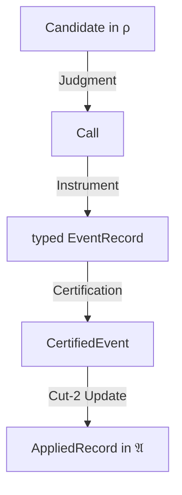
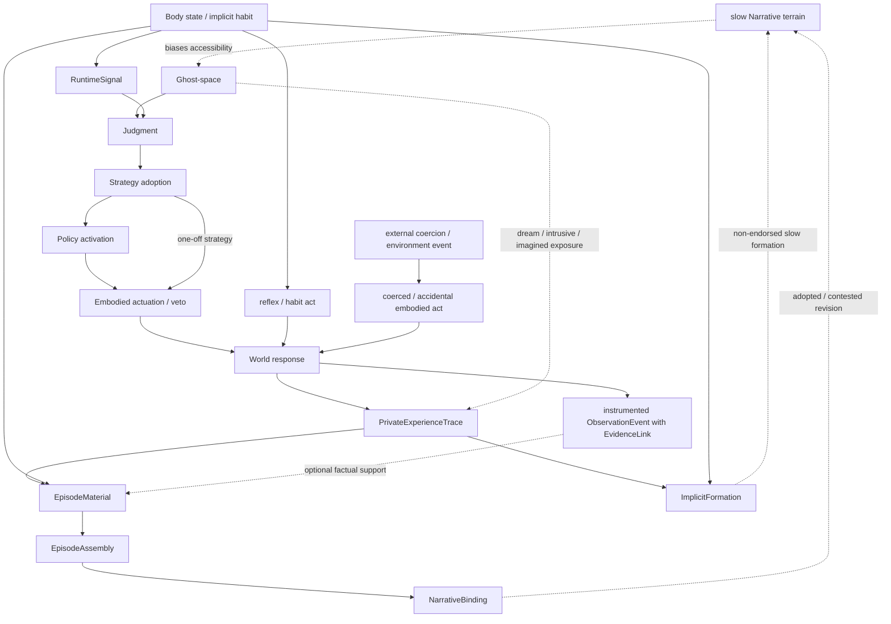

# Checkpoint 05-A — 최신 TAD로 다시 본 Chapter 01–05

## 권한 외골격에서 인간·생명 모델로: 회수된 요구사항, 현행 결손, 다음 합성 방향

> **상태:** 현행 이론 대조 분석 v1.0  
> **기준일:** 2026-07-12  
> **역사 범위:** Chapter 01–05와 Interchapter Note 03-A·04-A  
> **현행 기준:** `tad-theory` 저장소의 권위 규칙 + v7-dev4 integrated SPEC  
> **중요:** 현재 `canon/`은 비어 있다. 아래에서 “현행 TAD”는 저자 승인 canon이 아니라 가장 발전된 `TYPED-CANDIDATE`를 가리킨다.

---

## 0. 먼저 잠가야 할 권위 판정

이번 분석에서 “가장 최신 이론”을 단순히 수정 시각이 가장 늦은 파일로 정하지 않는다. 현재 저장소가 선언한 지위는 다음과 같다.

| 자료 | 현재 지위 | 이번 분석에서의 사용법 |
|---|---|---|
| `canon/` | `EMPTY` | 승인된 정본이 아직 없으므로 어떤 claim도 canon이라고 부르지 않음 |
| v7-dev4 integrated SPEC | `TYPED-CANDIDATE` | 내용상 가장 발전된 통합 기준점 |
| v7 00–02 | `CANDIDATE-KERNEL` | 최초 canon 심사 대상인 권한·증빙·적용 척추 |
| v7 03–04 | `CANDIDATE-MODEL` | 공간·시간적 합성 및 지속 모델. Kernel과 같은 권위가 아님 |
| v7 05–07 | `CANDIDATE-EXTENSION` | 공적 대표·정정·feedback·schema 확장 |
| v7 08 | `GOVERNANCE-SOURCE` | Claim OS와 승격 절차의 후보 설계 |
| Edition 0.1.5 standalone monograph | 현행 repo 권위 없음 | CORE·REGISTRY·OPS·MODEL도 포함한 역사적 평행 통합본. 그 안의 Humanstack 모듈만 Maturity `INFO`인 ANNEX READOUT/TRANSLATE이며 현행 repo manifest·registry에는 없음 |
| Chapter 01–05 | 역사 복원·연구 후기 | 과거 claim의 출처와 문제 압력을 복원하는 연구 문서 |
| Interchapter 03-A·04-A | `SYNTHESIS/BRIDGE/HOLD` | 사용자 보정과 교차챕터 합성. 원전이나 canon이 아님 |

이 구분은 형식적 주의사항이 아니라 이론 내용과 같다.

```text
오래됨 ≠ 원형 권위
정교함 ≠ canon
통합됨 ≠ 승인됨
구조적으로 닮음 ≠ 직접 승계
이번 분석의 좋은 Bridge ≠ 과거 문서에 이미 있던 주장
```

Imported registry의 29개 entry, 과거 audit의 46개 canonical claim, integrated SPEC의 48개 TAD 식별자가 서로 맞지 않는다. 그러므로 과거 `PASS`, `CANONICAL-DEV1`, 문서 frontmatter의 `Owner: canon/...` 표기를 현재 승인으로 재사용할 수 없다.

이 보고서가 할 수 있는 것은 다음까지다.

1. 현행 typed candidate가 무엇을 강하게 해결했는지 확인한다.
2. Chapter 01–05가 복원한 인간적 요구사항 중 무엇이 그 안에 살아남았는지 판정한다.
3. 빠진 것을 Kernel 수정, Model 후보, Human extension, Research HOLD로 분류한다.
4. 저자 승인 없이 어느 claim도 canon으로 승격하지 않는다.

---

## 1. 전체 결론

가장 압축된 판정은 이렇다.

> **최신 TAD는 인간 그 자체의 완성 이론이 아니다.**  
> **인간·생명 이론이 자기 느낌과 서사를 사실·증거·권한으로 불법 승격하지 않도록 만드는 typed accountability 외골격이다.**

반대로 Chapter 01–05는 완성된 현행 이론의 미숙한 버전만도 아니다.

> **Chapter 01–05는 그 외골격이 벼려지는 동안 잘려 나간 인간 모델의 요구사항을 보존한다.**

둘의 관계는 다음에 가깝다.

```text
현행 v7 typed candidate
= 권한·증빙·적용·공공성의 안전 골격

Chapter 01–05와 중간 노트
= 인간을 골격 안에 다시 넣을 때 잃으면 안 되는 요구사항과 반례군
```

현행 TAD가 특히 잘 답하는 질문은 이것이다.

```text
떠오른 후보가 왜 곧 사실이 아닌가?
느낌이 왜 외부 claim의 evidence가 아닌가?
EventRecord가 왜 곧 인증·적용이 아닌가?
기록·대표·공개가 왜 source identity나 정당성이 아닌가?
```

아직 충분히 답하지 못하는 질문은 이것이다.

```text
떠오른 것 중 무엇을 내가 호출·반복·계획·행동으로 인수하는가?
행동과 세계 결과가 어떻게 Episode가 되는가?
Episode 중 무엇이 장기 Narrative 지형으로 편입되는가?
누구의 미래·손상·연속성이 자기 유지 안으로 들어오는가?
그 내재화가 왜 타자에 대한 통제권은 아닌가?
생명은 변화 흐름을 어떻게 늦추고 시험하고 수리하며 자기 형태로 편입하는가?
```

따라서 지금의 연구 상태를 “인간 이론이 거의 끝났다”거나 “아직 아무것도 없다”로 말하면 둘 다 틀린다.

> **권한 척추는 상당히 선명하다. 인간적 연결 조직과 생명적 경계 모델은 아직 미완성이다.**

---

## 2. 최신 typed candidate가 실제로 세운 것

### 2.1 사다리가 아니라 typed partial cast graph

v7의 핵심은 값이 강해지며 자연스럽게 다음 단계로 올라가는 사다리가 아니다.



공적 대표는 마지막 화살표에 자동으로 붙지 않는다. 별도 경로를 다시 거친다.

```text
source AppliedRecords + PurposeSig
→ RepresentationEvent
→ CertifiedEvent
→ Cut-2 APPLIED
→ RepRecord in P

ContestRequest
→ CorrectiveCandidate in ρ
→ 새 typed event pipeline
```

각 화살표는 다음 계약을 새로 요구한다.

```text
source type
target type
gate
proof obligation
authority
cost
failure status
revision path
```

이 구조가 Chapter 01–05의 여러 봉인을 하나의 일반 언어로 다시 쓴다.

```text
Influence ≠ Warrant
Candidate ≠ Call
Call ≠ EventRecord
EventRecord ≠ CertifiedEvent
CertifiedEvent ≠ AppliedRecord
AppliedRecord ≠ Representative
Representative ≠ Source
```

### 2.2 네 상태면

```text
ρ_t   reversible candidate field
𝔄_t   append-only authoritative ledger
H_t   provenance·version·correction lineage
P_t   public representative interface
```

이 분리는 Chapter 01–05보다 강하지만, 인간 모델의 모든 residence를 제공하지는 않는다.

- `ρ`는 Thought·Candidate·RuntimeSignal을 둘 수 있지만 지속하는 비권위 기억·habit·Episode·Narrative의 writer와 durability를 아직 세분하지 않는다.
- `𝔄`는 감사 가능한 시스템 factness의 원장이지 자전적 기억이나 개인 Narrative 원장이 아니다.
- `H`는 source/version/archive lineage이지 인간의 기억·정체성 자체가 아니다.
- `P`는 목적에 결박된 공적 대표면이지 사적 self-image나 Narrative surface가 아니다.

즉 네 면은 인간 상태 전체의 완성 ontology가 아니라 권한 혼합을 막는 상위 분류다.

### 2.3 후보·신호·판정

현행 Candidate는 `producer`, `source_mode`, `created_at`을 가진다. `IMAGINED`, `RECALLED`, `INFERRED`, `REPORTED`, `OBSERVED_BUT_UNBOUND` 같은 source mode는 권한 등급이 아니라 뒤 proof obligation을 고르는 provenance hint다.

`Thought`는 심리적 실체가 아니라 `ρ` 안에서 후보를 생성·재조합하는 연산군이고, `RuntimeSignal`은 피로·불길함·편안함·긴급감·의미감 같은 비권위 신호다.

```text
RuntimeSignal
⇝ priority / delay / evidence request / avoidance / approach
↛ ExternalFact / EvidenceArtifact / CertifiedEvent / AppliedRecord
```

`Judgment`는 Candidate를 사실로 만드는 판정기가 아니라 `Call`, `HOLD`, `NOOP`, `REJECTED` 중 무엇을 낼지 고르는 Cut-1이다.

이 지점에서 v7의 Thought/Candidate와 Judgment를 이용해 평행 standalone Humanstack의 Ghost·Editor가 맡았던 최소 기능과 **구조적 대응**을 그릴 수 있다. 직접 계보도 동일 타입도 아니다.

```text
Ghost minimum  ↔ Thought / Candidate generation in ρ
Editor minimum ↔ Judgment / Call selection at Cut-1
```

하지만 이 대응은 인간적 Ghost·Editor 전체가 아니다.

### 2.4 Warrant와 View/Witness

Warrant는 값이 가진 고유 광채가 아니라 특정 claim·scope·epoch·jurisdiction에서 supporting relation이 주는 말할 권한이다.

```text
x ⇝ y
↛
x ⊢ claim
```

`Π_view`에는 이미지·서사·회상·확신·의미·simulation이, `Π_wit`에는 EvidenceArtifact·EvidenceLink·replayable witness path·calibration·method metadata가 놓인다.

```text
Π_view output ↛ same-tick Π_wit input
```

그러나 view는 버려지지 않는다.

```text
view / RuntimeSignal
⇝ Candidate
⇝ Call for observation
→ instrumented collection
→ ObservationEvent(with EvidenceLink[s])
→ Certification / Cut-2
```

이것은 Chapter 01의 “말을 죽이지 않고 사실을 봉인”하려는 문제를 가장 정밀하게 해결한 현행 구조다.

### 2.5 사건·증빙·인증·적용

현행 EventRecord는 하나의 느슨한 튜플이 아니라 여섯 variant의 tagged union이다.

```text
ObservationEvent
ControlEvent
TopologyEvent
CorrectionEvent
CompensationEvent
RepresentationEvent
```

그리고 다음 두 객체를 분리한다.

```text
Receipt
= 행위·이전·통제 변경이 실제 수행되었다는 replay trace

EvidenceLink
= scoped claim을 다시 방문 가능한 source·witness path와 결박하는 관계
```

따라서:

```text
Receipt ≠ EvidenceLink
검사를 실행했다 ≠ 외부 대상이 그렇게 생겼다
보상했다 ≠ 원래 손상 claim 전체를 새로 증명했다
```

Certification도 적용과 다르다.

```text
Certified
= Wellformed
 + Definable
 + GlueOK
 + CompileOK
 + event-specific ProofProfileOK
 + StampOK

Certified ≠ Applied
```

Applied가 되려면 Cut-2의 별도 write authority·epoch·concurrency·change closure 검사를 통과해야 한다.

이 구조는 Chapter 02가 끝내 한 타입으로 닫지 못했던 발생·흔적·증빙·제안·적용의 혼선을 가장 크게 해결한다.

### 2.6 로컬·전역·지속·공공성

현행 이론은 00–02를 넘어 다음도 구분한다.

```text
local admissibility ≠ SpatialSAT
한 window의 CertifiedBackbone ≠ 여러 window의 TemporalSAT
Spark ≠ Engine
Stored ≠ Discoverable ≠ Inspectable ≠ Contestable
Corrected ≠ Propagated
SchemaGap ≠ underlying truth
```

특히 `PurposeSig`, `ResidueProfile`, contest reentry, `FeedbackAudit`, `SchemaGap`은 Chapter 01–05에 없던 중요한 진전이다.

- 대표값은 목적·audience·jurisdiction·compression·protected field·source hook·correction path를 가져야 한다.
- 생략된 residue가 있다는 사실만으로 harm도 irrelevant도 되지 않는다.
- 각 cast가 합법이어도 전체 feedback trajectory가 자기강화 편향을 만들 수 있다.
- 현재 schema가 반복 사례를 type하지 못해도 그것을 false로 바꾸지 않고 schema review를 열 수 있다.

### 2.7 Claim OS와 이번 연구 방식

Chapter 05의 `Preservation ≠ Adoption ≠ Executable Participation`은 현행 repo governance와 구조적으로 강하게 대응한다. 이 문장 자체가 repo 설계의 선언된 source였다고 단정하지 않는다.

```text
source 보존
→ claim 추출
→ type·scope·boundary·provenance 결박
→ review
→ 저자 승인
→ canonical promotion
```

LLM 산출은 patch candidate이며 자기 산출의 review authority가 될 수 없다. 그러므로 지금 진행 중인 챕터 복원도 canon 작성이 아니라 **claim lineage와 요구사항 복구 작업**으로 보는 것이 맞다.

---

## 3. Chapter 01–05를 최신 TAD로 재판정한 지도

| 장 | 당시 핵심 문제 | 최신 후보에 강하게 살아남은 것 | 아직 약하거나 없는 것 | 현재 판정 |
|---|---|---|---|---|
| Chapter 01 | 자유롭게 말하고 상상하면서 사실을 사칭하지 않는 인간 | Candidate, RuntimeSignal, `Influence≠Warrant`, View/Witness, Cut-2-only authoritative update | 관계적 Self, Speech Stake, Body Veto, 기억 재공고화, Component Separation | 인간 요구사항의 출생층 |
| Chapter 02 | 발생·흔적·제안·적용·서사를 한 Commit에서 분리 | typed EventRecord, Receipt/EvidenceLink, Certified≠Applied, Cut-2, Candidate≠결론 | JOT court, self-adoption, Episode/Narrative, 미커밋 잔류, 반복 repair, 사랑 다축 | 현행 event 척추와 가장 강하게 대응하는 문제 선행층 + 인간 중간층 결손 |
| Chapter 03 | 퀄리아·서사·외부 입력이 권한을 탈취하지 못하게 함 | `Influence≠Warrant`, no same-tick view→witness, scoped Warrant, source/dependency/cast 검사 | 1인칭 체험의 제한된 지위, Narrative gravity, 대화·사랑·현재상의 인간적 동역학 | 현행 헌법과 가장 가까운 장 |
| Chapter 04 | 권한 없는 readout이 미래 작업을 어떻게 바꾸는가 | readout→routing의 문제틀, 다중 timebase 분리, finite search, delay/HOLD, actual work와 receipt 요구 | 현행 네 시계는 별도 재구성; explicit active/next activation type, Episode pressure, Body/Action/Outcome lane, 자기 경계 | 강한 선행 + strict next-only는 범위 수정 필요 |
| Chapter 05 | 보존된 문장을 어떻게 실행 계약으로 링크하는가 | registry, default-deny, read/write/no-touch, active/next, Decision/Record의 선행 구현 | 현행 CastContract·event-specific proof는 별도 추가 진전; 개인 Narrative residence, action/outcome handshake, self-boundary, life intake | 구조적 유비가 강한 선행 구현 후보 |

이 표의 중요한 점은 “살아남음”이 직접 문구 승계를 뜻하지 않는다는 것이다. 같은 문제를 다른 타입과 범위로 다시 풀었을 수 있다.

---

## 4. 장별로 무엇을 얻었고 무엇을 잃었는가

### 4.1 Chapter 01 — 인간적 문제는 살아 있고, 인간적 자아는 얇아졌다

Chapter 01을 현행에서 다시 읽을 때 얻는 중심 **합성**은 `Claim/Flux`라는 이름보다 두 요구의 동시 보존이다. 첫 규율은 원문에서 강하게 복원되지만, 둘째의 압축문은 기억·Residual·Debt를 묶어 연구 후기에서 추출한 Bridge이므로 원문 단일 명제로 소급하지 않는다.

```text
근거 없는 것은 공짜로 사실이 될 수 없다.
사실이 아니라고 인간에게 남긴 흔적까지 공짜로 0이 되어서는 안 된다.
```

첫 번째 요구는 최신 TAD가 매우 잘 보존한다. Candidate·RuntimeSignal·View는 조사와 라우팅을 바꿀 수 있지만 Warrant를 자체 발행하지 못한다. 다만 초기 Flux에는 질문·농담·감정표현·비유 같은 **공적 비단정 발화**도 있었다. `Π_view/Π_wit`는 사실 문턱을 정밀하게 닫지만, 그러한 발화가 관계에 만드는 Speech Stake·상호 해석·후속 의무까지 설명하지는 않는다. 별도 `ExpressionAct / CommunicativeAct / relational consequence`가 인간 모델의 결손으로 남는다.

두 번째 요구는 일부만 남았다. 현행에는 Ω·Receipt·correction lineage가 있지만, 다음은 충분히 없다.

- 말이 관계에 남기는 Speech Stake
- 선택되지 않은 후보가 prosody·거리감·다음 접근 비용에 남기는 흔적
- 몸이 논리와 다른 실행 가능성을 갖는 Body Veto
- 기억을 삭제하지 않으면서 접근 잠금·재공고화를 수행하는 계약
- 타인의 오해·거절·응답 속에서 형성되는 관계적 Self

평행 standalone Humanstack INFO Annex의 `Self = tracking`은 좋은 최소 문장이지만, **무엇을 누구와 어떤 반사 속에서 추적하는가**가 빠져 있어 초기 자아보다 얇다.

### 4.2 Chapter 02 — Event 척추는 현행 후보에서 정교해졌지만 ‘내가 된 사건’은 아직 없다

Chapter 02는 EventRecord를 완성한 장이 아니라 중간 타입을 끝내 닫지 못해 후대의 분리를 요구한 장이다. 그 문제군이 최신 typed candidate에서 가장 정교하게 분리되었다.

```text
Potential ≠ Irreversible
EventRecord ≠ CertifiedEvent ≠ AppliedRecord
Receipt ≠ EvidenceLink
```

그러나 인간에게 중요한 다른 분리는 현행 타입이 아니다.

```text
무언가가 떠오름
≠ 내가 호출함
≠ 내가 반복·연습함
≠ 내가 전략으로 채택함
≠ 몸으로 실행함
≠ 세계에서 결과가 일어남
≠ Episode가 형성됨
≠ Narrative에 인수됨
```

평행 standalone Humanstack INFO Annex의 Editor는 Cut-1 `Call` 선택까지만 담당한다. JOT court가 붙들던 “이 후보를 내 입장·내 책임·내 미래로 인수할 것인가”는 없다.

또 `Trace`는 authoritative receipt와 runtime residue를 구별하기 시작하지만, 다음을 충분히 나누지 않는다.

```text
Ghost content
Editor call / rehearsal trace
uncommitted residue
Action trace
world outcome evidence
Episode integration
Narrative incorporation
```

이 중간층은 현재 인간 모델의 가장 큰 결손이다.

### 4.3 Chapter 03 — 방화벽은 거의 현행이 되었고 체험의 내용은 빠졌다

Chapter 03의 Universal Linter 계열은 현행 typed CastContract와 가장 가깝다.

- label보다 source·lane·scope를 검사한다.
- readout과 SSOT를 가른다.
- 외부 입력도 source event 없이 진실이 되지 못한다.
- 지연·반복·결정성이 warrant를 만들지 못한다.
- 연구 산출도 자기 권한을 만들지 못한다.

최신 TAD는 이를 다음으로 더 정밀하게 만든다.

```text
Influence relation / Warrant relation
Candidate / ClaimSig / Call
Π_view / Π_wit
Event-specific ProofObligation
Certification / Application
SchemaGap / TopologyReview
```

반면 Chapter 03의 인간적 잔차는 남는다.

- 현재를 과거 앵커와 미래 초안 사이에서 계속 푸는 Perspective
- 사랑을 “덜 비틀어도 되는 자기 편집 지형”으로 느끼는 면
- Qualia를 단지 임피던스 값이 아니라 당사자에게 무엇처럼 나타나는가의 1인칭 면
- 대화가 서로의 미래 후보 공간을 굽히는 관계 동역학
- 실패한 초안과 붕괴 위치를 남기는 JOT

평행 standalone Humanstack의 `ΦΩ`는 Narrative gravity가 candidate·call 접근 비용에 미친 **효과를 읽는 파생 readout 후보**가 될 수 있다. 그러나 Narrative의 집도 v7 현행 타입도 아니다. Episode graph·정체성·해석·수리 이력을 가진 별도 slow structure가 필요하며, 그것을 하나의 scalar impedance로 줄이면 안 된다.

### 4.4 Chapter 04 — “무조건 다음 tick”은 현행에서 더 정밀한 네 lane으로 갈라져야 한다

Chapter 04의 큰 성과는 지연이었다.

```text
readout_t
↛ current authority
→ future work allocation
```

그러나 최신 TAD는 모든 영향에 보편적인 next-only 규칙을 두지 않는다. `RuntimeSignal→JudgmentPolicy` registry edge는 priority·delay·evidence request·concurrency limit을 허용하고, Chapter 01 산문은 avoidance/approach routing도 허용 효과로 든다. 정확한 scheduler latency나 same-tick 신체 행동까지 정의하지는 않는다. 헌법의 no-same-tick 봉인은 view가 Witness로 승격되는 것을 막지 비권위 routing 자체를 금지하지 않는다.

생명을 생각하면 모든 보호 routing을 보편적으로 다음 tick까지 미루지 않는 편이 더 유망하다. 다만 통증·위험감에서 실제 행동으로 가는 길은 아직 현행 v7에 완성된 embodied-action cast가 아니므로 Human Model에서 별도 authorization·Body path를 정의해야 한다.

따라서 Chapter 04의 통찰은 네 lane으로 범위를 수정하는 편이 좋다.

```text
1. Potential immediate non-authoritative routing
   RuntimeSignal → HOLD / inspect / avoid / reduce scope
   exact scheduling은 domain contract에서 결정

2. Delayed strategy or self-modifying policy adoption
   Narrative/readout → PolicyProposal
   effective_from / activation_epoch 필요

3. Authoritative ledger-state update
   typed EventRecord → Certified → Cut-2 Applied
   self-warrant 금지

4. Human identity / Narrative update
   별도 Human Model transition과 revision path 필요
```

즉 active/next pointer는 폐기할 구조가 아니다. 다만 모든 readout influence의 보편법이 아니라 **정책 학습·후보공간 재편·자기확증 위험이 있는 transition의 ActivationContract**로 재도입할 후보가 된다.

### 4.5 Chapter 05 — 통합 공장은 강한 선행 구현 후보이지만 STG는 아니다

0117 공장의 Registry·Socket·Closure는 현행 typed partial cast graph와 강한 구조적 유비를 가진 선행 구현 후보다. source receipt가 없으므로 직접 기술 계보로 확정하지 않는다.

```text
Registry-first
read / output / no-touch / write
표에 없으면 deny
active / next
Decision / Record
Pack integrity
```

기능별로 비교하면 현행 typed candidate는 이를 더 넓은 CastContract로 별도 재구성한다.

```text
gate뿐 아니라
proof + authority + cost + failure + revision
```

또 Chapter 05가 못 만든 evidence port에 대응해 현행 후보는 ObservationEvent·EvidenceLink를 별도로 추가하고, Decision/Record 혼선에 대응해 Certification/Application을 가른다. Registry 밖 경험의 문제에는 반복 증빙을 요구하는 SchemaGap review path를 제공한다. 이것들은 직접 승계가 아니라 기능 비교다.

그러나 후기 STG의 monolithic `F`는 현행 구조의 종점으로 복구할 대상이 아니다. 후보·Choice·Commit·ActionOut을 한 함수에 배치하고 world-outcome lane을 생략하면 `Certified ≠ Applied`와 action/world-result 분리를 세울 수 없다.

보존할 것은 Cut-2-only authoritative write boundary이고, 버릴 것은 내부 타입을 접어버린 단일 signature다.

---

## 5. 네 가지 중요한 현행 교정

### 5.1 지연은 권한 타입을 대신할 수 없다

초기 이론은 same-tick 누수를 막기 위해 “다음 박자”를 강하게 사용했다. 이것은 유효한 구현 봉인이지만 충분조건도 보편법도 아니다.

```text
한 tick 늦음 ≠ warrant 획득
오래 기다림 ≠ evidence 생성
다음 정책에 들어감 ≠ 정당한 행동 권한
```

반대로 즉시 반응도 모두 불법이 아니다.

```text
위험감 → 즉시 멈춤
통증 → 즉시 부하 축소
불길함 → 즉시 검사 Call
```

이들은 외부 claim을 인증하지 않으면서 생명을 보호할 수 있다.

따라서 최신 합성은 `time delay`와 `authority cast`를 직교화해야 한다.

### 5.2 Billing Arrow는 최신 Kernel의 보편 봉인이 아니다

Edition 0.1.5의 embedded COREANNEX21 S5는 Billing Arrow를 다음처럼 강하게 썼다.

```text
rcpt → debt → debt[age] → bill
무흔적 역상쇄 경로 부재
```

같은 standalone Edition의 후반 Human laws 번역은 이를 `No free change`라고 압축한다. 이것은 S5 원문의 별도 봉인 문구와 같은 지위가 아니다. Humanstack Ω `INFO` Annex는 또 별도로 Ω conservation/migration을 제안했다. 세 지위와 claim을 한 묶음으로 읽으면 안 된다.

v7 typed candidate는 같은 문제군을 더 제한적인 typed obligation·cost model로 표현한다. 이것이 standalone Edition의 직접 개정 계보라는 뜻은 아니다.

- `Ω_wit`, `Ω_ops`, `Ω_bill`을 서로 다른 obligation으로 둔다.
- 각 감소에는 종류에 맞는 사건 trace가 필요하다.
- obligation이 한 component에서 다른 component로 이동할 수는 있지만 보존법칙은 아니다.
- scope의 합법적 종료, 실제 proof closure, 외부 capacity 지원, claim 철회로 obligation이 사라질 수도 있다.
- 비용은 actor·horizon별 vector이며 동일량 보존을 주장하지 않는다.

따라서 “공짜 소거 금지”는 다음처럼 범위를 나눠야 한다.

```text
authoritative ledger change
→ No Silent Update

relation topology·지속적 runtime 변화
→ scoped trace·cost·repair 계약 후보

찰나의 Ghost content
→ 내용 기록 없이 만료 가능
```

모든 상상을 기록하거나 모든 변화에 bill token을 요구하면 Ghost의 가역 자유가 사라진다. Chapter 06에서 Billing Arrow의 발생 계보를 읽을 때 이 현행 교정을 기준으로 감사해야 한다.

### 5.3 Registry 밖이라는 이유로 거짓도 폐기도 아니다

Chapter 05의 registry-first는 runtime 참여를 제한했다. 기능별로 비교하면 최신 `SchemaGap`은 그 사각지대와 유사한 문제를 별도 review path로 다룬다. 직접 승계 판정은 아니다.

```text
현재 type 없음
≠ false
≠ irrelevant
≠ 공식 폐기
```

그러나 한 번 이름이 없었다고 곧바로 SchemaGap도 아니다. 최소한 반복 untypability, failed cast, nearest miscast, distortion trace가 필요하다.

현재 인간 모델에서 다음은 우선 **schema-design gap 후보**다. 반복 untypability·failed cast·nearest miscast·distortion trace가 실제로 쌓이고 collection window, current schema·vocabulary·jurisdiction, case diversity, attempted lawful encodings와 alternatives, underlying status, independent review가 결박될 때에만 정식 `SchemaGap → TopologyReviewPacket` 후보가 된다.

- durable but non-authoritative Episode/Narrative residence
- strategy의 activation epoch
- Ghost의 spontaneous / invoked / rehearsal / plan 구분
- Action과 world Outcome의 결박
- self-adoption과 authorship
- multi-axis SelfBoundaryProfile

생명 정의는 아직 이보다도 앞선 `RESEARCH/HOLD`다. 타입이 없다는 이유만으로 즉시 schema change를 요구할 수 없다.

### 5.4 불법 cast가 없어도 자기확증 궤적은 생긴다

최신 v7의 `FeedbackAudit`은 public Representative·PublicScheduler·control rule이 다음 sampling과 threshold를 바꾸는 궤적을 감사한다. 모든 개별 transition이 합법이어도 전체 궤적은 자기강화될 수 있다는 구조다.

> **[BRIDGE]** 인간 내부 Narrative에도 이와 유사한 궤적 감사가 필요할 수 있다. v7이 Narrative를 `FeedbackAudit`의 현행 target으로 등록했다는 뜻은 아니다.

인간 내부에서도 같은 문제가 가능하다.

```text
Narrative_t / SelfBoundaryProfile_t
⇝ candidate accessibility / attention / threshold
→ 어떤 Call과 관계 접촉이 실제로 선택되는가
→ 어떤 Episode가 더 자주 만들어지는가
→ Narrative_{t+1}
```

여기에는 `Narrative → Witness` 직접 불법 cast가 없을 수 있다. 각각의 Episode도 실제 사건일 수 있다. 그런데도 선택적으로 경험한 사건열이 기존 Narrative를 계속 강화할 수 있다.

```text
valid local experience records
+ biased sampling and avoidance trajectory
```

는 모순이 아니다.

따라서 인간 모델에는 단일 candidate의 provenance뿐 아니라 다음을 보는 2차 감사가 필요할 수 있다.

- 어떤 Narrative가 무엇을 더 쉽게 떠올리게 했는가
- 무엇을 반복 조사하고 무엇을 회피했는가
- 같은 signal에 actor·관계·label별로 다른 threshold가 적용됐는가
- 반례가 Ghost에 생성되지 않은 것인지, Editor가 보류한 것인지, 세계 접촉 기회가 없었던 것인지
- 독립적 source·label-blind review·다른 관계 맥락에서 같은 경사가 유지되는가

이것이 Chapter 04의 “How가 What을 바꾼다”는 문제를 최신 FeedbackAudit와 연결하는 가장 강한 Bridge다.

---

## 6. Ghost·Editor·Body·Episode를 최신 타입 옆에 다시 세우면

### 6.1 그릴 수 있는 최소 구조적 대응

```text
Ghost minimum
~ v7 Thought / Candidate generation in ρ

Editor minimum
~ v7 Judgment that emits Call / HOLD / NOOP / REJECTED

World-fact entry in v7
= instrumented collection
→ ObservationEvent(with EvidenceLink[s])
→ Certification

authoritative change in v7
= CertifiedEvent → Cut-2 APPLIED
```

`~`는 기능적 유비다. Ghost·Editor가 v7 현행 타입으로 채택되었다거나 위 대응이 직접 계보라는 뜻이 아니다. 그리고 이 최소 대응은 인간을 설명하기에는 너무 얇다.

### 6.2 Editor 하나에 뭉개진 다섯 역할

인간 모델에서 “Editor”라 부른 것에는 적어도 다음 역할이 섞여 있다.

| 역할 | 질문 | 최신 후보와의 관계 |
|---|---|---|
| Candidate gate | 무엇을 볼·비교·보류할 것인가? | `Judgment / Call`과 강한 기능 대응 |
| Strategy adopter | 어떤 후보를 계획과 미래 정책으로 인수할 것인가? | 명시 타입 부족 |
| Embodied actor | 몸으로 무엇을 외부화할 수 있는가? | 일반 타입 부재. 기존 Receipt는 수행 trace 일부를 담을 수 있으나 ControlEvent는 설정·자원·임계 control-state 변경에 한정 |
| Outcome observer | 세계에서 실제 무엇이 일어났는가? | claim-specific ObservationEvent + EvidenceLink 필요 |
| Autobiographical curator | 무엇을 Episode·Narrative·정체성으로 편입할 것인가? | 현행 타입 없음 |

하나의 Editor가 이 모든 권한을 가지면 다시 주권적 자아가 된다. 따라서 인간 모델은 역할을 분해해야 한다.

몸도 마지막 actuator나 veto가 아니다.

- 반사·충동·피로·공포를 RuntimeSignal과 Ghost에 올리는 발생면이다.
- 습관·외상·손상을 암묵적으로 보존하는 매질이다.
- 전략이 실제 행동이 될 수 있는지 제한한다.
- 세계 노출이 처음 닿는 접촉면이다.
- 몸이 먼저 반응하고 나중에 저자화가 따라오는 경로도 만든다.

### 6.3 직렬 파이프라인이 아닌 분기 루프

> **[MODEL CANDIDATE — canon 아님]**



이 모델은 전략 채택 없이도 행동과 형성이 생길 수 있음을 보존한다.

- 반사·습관·강요·사고는 `StrategyAdoption`을 우회할 수 있다.
- 일회성 전략 행동은 지속 정책 변경 없이 `StrategyAdoption→Body`로 갈 수 있다. `PolicyActivation`은 future-effective policy·habit·지속 제어를 바꾸는 경우에 필요하다.
- 꿈·환각·침투적 사고·오해·불완전 감각도 `PrivateExperienceTrace`와 Episode 재료를 만들 수 있다.
- 그것은 “외부에서 해석한 일이 실제였다”는 EvidenceLink는 아니다.
- 세계 결과가 제대로 관측되지 않아도 몸과 체험 흔적은 남을 수 있다.
- 반대로 외부 결과 EvidenceLink가 있어도 당사자의 Episode 의미를 자동 결정하지 않는다.
- 반복 노출·외상·조건화는 endorsement를 거친 `NarrativeBinding` 없이도 `ImplicitFormation`으로 느린 접근 지형을 바꿀 수 있다. 두 writer를 합치지 않는다.

```text
Generation ≠ Authorship
Authorship ≠ Strategy
Strategy ≠ Action
Action ≠ Outcome
Private experience ≠ external outcome evidence
Outcome evidence ≠ Episode meaning
Episode material ≠ assembled Episode
Episode ≠ Narrative automatic write
Narrative influence ≠ world warrant
```

### 6.4 필요한 신규·세분 타입 후보

| 후보 타입 | 최소 필드·기능 | 권한·privacy 제한 |
|---|---|---|
| `UnregisteredGhostFlux` | 등록 전의 휘발 이미지·충동·대사·변이 | 내용 trace 없이 만료 가능. 완충지대 보존 |
| `GhostCandidate` | 실제 Judgment에 투입된 candidate의 content ref, source mode, spontaneous/invoked, expiry | 후보 residence만. 모든 Ghost 내용을 기록하지 않음 |
| `CandidateSearchAudit` | generator, frontier, budget, omitted region의 최소 통계 | 내용 최소화·retention·privacy 필요. 생성되지 않은 후보 전체의 증명 아님 |
| `EditorTrace` | recalled, rehearsed, held, adopted-strategy refs | 호출·반복 행위 trace. 내적 진실이나 정체성의 증명 아님 |
| `StrategyAdoption` | selected proposal, endorsement scope, reversibility, review point | Cut-2도 실제 행동도 아님 |
| `PolicyActivation` | proposal_ref, effective_from, activation_epoch, scope | current/next와 보호 routing을 구별 |
| `BodyState / BodyTrace` | capacity, pain/fatigue signal, reflex, damage/recovery trace | Body를 논리의 하위 actuator로 축소하지 않음 |
| `PerformedActionReceipt` | actor, proposal or reflex ref, expressed action, reported_body_cost, time | 행동 수행만 warrant. 실제 body cost claim은 별도 관측이 필요할 수 있음 |
| `OutcomeObservation` | target, method, source provenance, EvidenceLink, coverage, uncertainty | 세계 결과 claim 전용 |
| `PrivateExperienceTrace` | phenomenal exposure, confidence, body surface, source mode | 체험 발생의 제한된 흔적. 외부 원인의 evidence 아님 |
| `EpisodeMaterial` | exposure·action·body·outcome·report fragments | 파편·불확실·미청산 상태 허용 |
| `EpisodeAssembly` | material refs, imposed/authored degrees, gaps, unsettled residue | 완성된 factual record가 아닌 개인적 조립 |
| `NarrativeBinding` | episode refs, interpretation, adopted/rejected/contested, revision hook | 느린 비권위 지형 갱신 |
| `DurableNonAuthoritativeStore` | persistence, writer, update clock, retention/reconsolidation | `Persistence ≠ Authority`의 명시 residence |

`OutcomeReceipt`라는 이름만 두는 것은 부족하다. Attester 하나가 있다고 외부 claim이 EvidenceLink가 되지는 않는다. method·source provenance·coverage·uncertainty가 필요하다.

### 6.5 1인칭 체험 보고의 좁은 지위

인간 모델에는 다음 세 claim을 갈라야 한다.

```text
“나는 고통을 느낀다.”
≠ “외부 X가 그 고통을 일으켰다.”
≠ “그러므로 공적 조치 Y가 정당하다.”
```

첫 문장은 1인칭 체험 보고 또는 그 발화가 실제 있었다는 CommunicativeAct로 좁게 다룰 수 있다. 두 번째는 외부 원인에 대한 ObservationEvent·EvidenceLink를, 세 번째는 별도 규범·권한·관할 계약을 요구한다. 1인칭 보고를 외부 원인 evidence로 승격하지 않으면서도 체험 자체를 0으로 만들지 않는 타입이 필요하다.

---

## 7. 자기 경계는 Two-Cut 경계도, 물리적 막도 아니다

### 7.1 현행 TAD에 없는 타입

v7에는 scope·jurisdiction·authority relation이 있지만 `SelfBoundary` 타입은 없다. `IdentityContinuous`도 Thread의 record identity mapping이지 인간의 자아 연속성 정의가 아니다.

따라서 다음 동일시는 금지해야 한다.

```text
SelfBoundary ≠ boundary between ρ and 𝔄
SelfBoundary ≠ organism membrane
SelfBoundary ≠ Public Lens
SelfBoundary ≠ PurposeSig
SelfBoundary ≠ EOE
SelfBoundary ≠ AuthorityGrant
```

### 7.2 자기 경계의 다축 profile

> **[HUMAN MODEL CANDIDATE — 사용자 보정 기반]**

| 축 | 질문 | 자동 승격 금지 |
|---|---|---|
| `Belonging` | 같은 편·관계망에 속한다고 체험하는가? | 귀속감 ≠ 상호 계약 |
| `Stake` | 그 미래에 시간·자원·자기를 얼마나 걸었는가? | 큰 배팅 ≠ 옳음 |
| `Responsibility*` | felt·causal·assumed·contractual·public responsibility 중 무엇인가? | 한 층의 책임 ≠ 다른 층의 자동 성립 |
| `Authorship*` | 행동 개시·인과 참여·사후 책임 인수·Narrative adoption·공적 귀속 중 무엇인가? | 행동 저자성 ≠ 결과 통제 ≠ 공적 귀속 |
| `Identity` | 이것을 잃으면 자기 연속성이 얼마나 무너지는가? | 제거비용 ≠ 건강한 사랑 |
| `Authority_felt` | 대신 결정하거나 통제할 권리가 있다고 느끼는가? | 느낌 ≠ 정당한 관할 |

`Authority_valid`는 이 profile에서 자동 산출되지 않는다.

```text
Candidate authority assessment must separately inspect, by domain:
consent or its lawful exception
role / contract / public rule
transition scope and jurisdiction
grounds and proof profile
current capacity
expiry / review / appeal path
```

이 목록은 `Authority_valid`의 보편 충분조건 공식이 아니다. 의료 응급, 후견, 계약, 조직 역할, 친밀 관계는 서로 다른 proof profile과 예외를 가진다. 위 여섯 축도 최종 scalar가 아니라 첫 분해 좌표다.

가족은 Belonging·Stake·Responsibility의 여러 층·Identity가 높으면서도 서로에 대한 Authority가 제한될 수 있다. 이것이 타자성을 지우지 않는 확장된 자기 경계다.

### 7.3 실제 서사가 원인이라는 말의 정확한 위치

자기 경계 축을 독립적인 성격 노브로 두면 사용자의 핵심 보정이 사라진다. 다만 모든 축을 Episode→Narrative readout 하나로 만들 수도 없다.

```text
Episode / slow Narrative
→ felt belonging, stake, identity, subjective adoption

Body / implicit habit / environment
→ causal dependency, loss sensitivity, non-narrated formation

promise / consent / contract / public rule
→ assumed or valid responsibility and authority assessment

the resulting profiles
⇝ candidate access / routing impedance / Judgment
```

평행 standalone Humanstack의 `ΦΩ`는 마지막 routing impedance를 읽는 연구 기호 후보일 뿐, 자기 경계나 Narrative residence 자체가 아니다.

같은 사실 묶음도 사람마다 다른 Narrative 경사를 만들 수 있다. 흉악범 양부모 사례에서 범죄 사실, 돌봄 사실, 동기, 함께 산 기억, 현재 자기의 의미는 동시에 보존된다. 이 중 어떤 하나도 나머지를 자동 삭제하지 않는다.

그러나 Narrative가 외부 사실을 다시 쓰지는 못한다.

```text
범죄 사실과 그 증빙
≠
그 사람을 현재 관계 안에서 어떻게 인수할지
```

자기 경계는 현재 관계 profile만이 아니라 미래 궤적의 경계이기도 하다.

```text
이 행동 뒤의 나를 계속 내 삶으로 인수할 수 있는가?
이 관계를 버린 미래가 자기 연속성을 유지하는가?
현재 몸의 손실을 감수하며 보호하려는 장기 패턴은 무엇인가?
```

Chapter 02의 α는 노출·행동을 자기 사건으로 저자화하는 정도, β는 미래 Narrative에 자원과 가능성을 거는 장기 lock을 붙들었다. 이 둘을 현재 Stake/Authorship의 이름만으로 소거하면 희생·약속·long bet의 시간 구조가 사라진다. 다만 α·β를 현행 타입과 동일시하지 않고 Human Model의 재검토 대상으로 둔다.

### 7.4 formed-by와 endorsed-by

자기를 만든 모든 것을 자기가 승인한 것은 아니다.

```text
formed_by
≠ felt_as_self
≠ endorsed_as_self
≠ responsible_for
≠ authorized_over
```

외상·강요·중독·조건화는 실제 후보 접근성·몸 비용·경계감을 바꿀 수 있다. 그렇다고 그것들이 승인된 정체성이 되지는 않는다. 반대로 죄책감이 없다고 계약상 책임이 자동 소멸하지도 않는다.

이 구분은 현행 `Influence ≠ Warrant`와 **구조적으로 유비**하다. 그러나 self-adoption은 epistemic warrant가 아니라 별도 인간 transition이므로 둘을 같은 정리로 만들지 않는다.

### 7.5 Narrative는 Public Lens가 아니지만 그 계약을 빌릴 수 있다

개인의 Narrative를 현행 `P_t`의 Public Representative와 동일시하면 안 된다. Narrative는 공적 발행 record도 아니고, 반드시 public source closure나 review authority를 갖는 것도 아니다.

그러나 Public Lens가 발견한 다음 문제는 더 넓은 Narrative terrain에서 특정 자기상을 투영할 때 유사하게 재발한다.

```text
broader Narrative terrain
+ provenance-tagged Episode / body / report / imagined materials
→ 특정 미래 조정 목적 아래 압축
→ 일부 기억·관계·책임을 전면에 둠
→ 일부를 보호·유예·생략·왜곡함
→ 현재의 self-facing representation을 만듦
```

이 투영은 Narrative terrain 전체가 아니다. 암묵 애착·외상·습관·몸 기억처럼 현재 목적을 위해 선택적으로 압축되지 않은 형성도 그 아래에 남는다.

따라서 별도 `PrivateNarrativeLens` 모델은 다음 계약을 차용할 수 있다.

| Public Lens에서 빌리는 것 | 개인 Narrative에서의 번역 |
|---|---|
| source material | EpisodeMaterial·행동·결과·관계 trace뿐 아니라 provenance가 표시된 전언·오해·상상·거짓 기억·미확정 체험 |
| PurposeSig | 현재 자기조정·보호·계획이라는 제한된 목적 |
| RepresentationProfile | 무엇을 현재 자기상으로 전면화했는가 |
| ResidueProfile | 생략·보호·유예·미해결·왜곡된 Episode |
| correction hook | 새 증거·타인의 증언·치료·재해석에 의한 수정 경로 |
| version lineage | 과거 자기상과 현재 자기상의 교정·대체 관계 |
| stale review | 현재 삶과 맞지 않는 오래된 자기상 점검 |

이 Bridge의 핵심은 다음이다.

```text
A PrivateNarrativeLens is a purpose-bound projection of broader Narrative terrain
≠ Narrative terrain itself
≠ Episode or experience source identity
≠ external truth ledger
≠ permanent essence
```

복수 Narrative가 존재할 수 있다는 사실도 자동 모순은 아니다. 자녀로서의 자기, 연구자로서의 자기, 피해·돌봄·책임의 자기상은 서로 다른 목적과 scope를 가질 수 있다. 문제는 하나가 다른 모든 source와 correction path를 지운 채 보편적 본질을 사칭할 때 생긴다.

### 7.6 SelfBoundary와 별도로 RelationProfile이 필요하다

자기 경계 하나에 사랑·미움·애착·의존·타자성까지 넣으면 초기 Component Separation을 잃는다. 높은 Identity dependency나 제거비용은 사랑뿐 아니라 공포 적응·미움·중독·강요된 의존에서도 나타날 수 있다.

> **[HUMAN MODEL CANDIDATE]** 관계에는 별도 profile이 필요하다.

```text
RelationProfile := {
  valence,
  bind / recall frequency,
  remove_cost,
  mutuality,
  otherness_preserved,
  care and repair history,
  trust and contest paths,
  dependency asymmetry,
  consent and exit conditions
}
```

이 profile도 한 scalar로 합산하지 않는다.

```text
자꾸 떠오름 ≠ 좋아함
좋아함 ≠ 함께 살기 쉬움
떼기 어려움 ≠ 건강한 사랑
높은 Stake ≠ 상호성
수리 책임을 인수함 ≠ 타자 통제권
```

또 현재 초안의 한 인간–수동적 World 구도만으로는 Speech Stake·대화·가족·동의를 설명할 수 없다. 최소 두 독립 주체가 각자의 Body·Episode·Narrative·Authority를 가진 채 같은 사건을 다르게 통합할 수 있어야 한다.

```text
Shared event
≠ shared Episode
≠ shared Narrative
≠ mutual agreement
≠ shared Authority
```

발화 역시 payload 전달만이 아니다. `ExpressionAct`는 사실 claim이 아니어도 상대에게 communicative exposure를 만들고 intake·candidate·experience material을 기울일 수 있다. 그러나 발화자는 상대의 Episode·Narrative·RelationProfile writer가 아니다.

```text
ExpressionAct
⇝ another agent's intake / candidate / experience material
↛ another agent's Episode or Narrative direct write
```

그 노출을 상대가 어떻게 처리했는지와 그 반응이 다시 발화자에게 돌아오는 과정에서 양쪽 자기가 달라질 수 있다. 평행 Humanstack의 `ΦΩ`는 임피던스 효과를 읽는 한 후보일 뿐이다. 이 관계 효과는 Warrant와 분리하면서도 0으로 지우지 않아야 한다.

---

## 8. 생명 가설을 최신 TAD에 올릴 때

### 8.1 현행에서 빌릴 수 있는 것

v7의 Temporal Sustain은 다음을 제공한다.

- 한 창의 `CertifiedBackbone`과 여러 창의 `Thread` 분리
- identity·schema·proof·correction·resource·Applied anchor의 continuation report
- `Spark ≠ Engine`
- maintenance feasibility
- `Ω_wit / Ω_ops / Ω_bill`
- actor·horizon별 closure-cost vector
- 지속 실패와 도덕 실패의 분리

이는 “흐름 속에서 형태를 유지한다”는 생명 가설에 유용한 형식 어휘와 조건부 predicate를 제공한다.

### 8.2 현행이 일부러 주장하지 않는 것

그러나 v7은 다음 등식을 거짓으로 증명한 것이 아니라 **주장하지 않고 장의 범위 밖에 둔다**.

```text
Engine = life universal law
TemporalSAT = living
all physical / social / biological systems reduce to one ledger grammar
Ω = universal conserved substance
```

현행 repo가 import 상태로 보존한 v7-dev4 migration ledger의 `MIG-028`도 life·gravity·civilization homology를 `QUARANTINE`으로 기록한다. 이것은 현행 canon 승격 결정이 아니라 imported migration 판단이다. 따라서 Chapter 04-A의 생명 문장은 아직 `BRIDGE/HOLD`가 맞다.

### 8.3 조건부 Life Model 후보

> **[RESEARCH MODEL — assumptions와 countermodel 필요]**

생명을 단순 지속 구조와 구별하려면 최소 다음을 시험해야 한다.

1. **Open intake** — 외부 에너지·물질·정보 흐름과 실제로 접촉한다. 이 가정은 v7 Temporal Sustain의 export가 아니라 평행 Humanstack Ω `INFO` Annex에서 온 연구 입력이다.
2. **Selective incorporation** — 모든 변화가 즉시 내부 지속 상태를 덮어쓰지 못한다.
3. **Temporal delay** — 가역 반응·시험·정책 선택과 비가역 편입 사이에 시간적 두께가 있다.
4. **Endogenous maintenance** — 경계·조직·처리 능력을 자기 내부 과정으로 수리·재생한다.
5. **Embodied testing** — 행동이 세계와 접촉하고 결과가 되돌아온다.
6. **Repair and settlement** — 손상·오류·비용이 형태 유지 과정에서 처리된다.
7. **Continuation criterion** — 무엇이 유지되면 같은 생명 패턴이라고 부를지 명시한다.

여기에 reproduction·evolution·autopoiesis를 필요조건으로 둘지는 아직 열려 있다.

이 조건 없이 “오래 지속하고 ledger가 있는 것”을 생명이라 부르면 회사·프로젝트·문서 저장소도 자동으로 생명이 된다. 반대로 물리적 막만 요구하면 가족·가치·미래 서사를 포함하는 정신적 자기 경계를 설명하지 못한다.

### 8.4 경계의 가장 유망한 재정의

현재 가장 강한 생명 Bridge는 다음이다.

> **경계는 안과 밖을 가르는 선만이 아니라, 어떤 변화가 지금의 패턴을 즉시 다시 쓸 수 있는지 제한하고 일부만 시험·비용·결과·수리를 거쳐 다음 패턴으로 편입하게 하는 지연된 선택 구조다.**

이 문장은 아직 생명 정의가 아니다. 그러나 Chapter 06 이후의 Witness·Grounds·Receipt 계열이 견뎌야 할 가장 좋은 연구 가설이다.

---

## 9. 지금 무엇을 어디에 둘 것인가

### 9.1 최초 canon 심사 후보에 남길 것

00–02 Kernel에서 우선 심사할 것은 다음 척추다.

```text
Influence ≠ Warrant
typed ρ / 𝔄 / H / P distinction
Candidate / Judgment / Call
View / Witness no-promotion
typed EventRecord
Receipt ≠ EvidenceLink
event-specific ProofObligation
Certified ≠ Applied
No Silent Update
```

이 목록도 아직 승인된 canon은 아니다. 출처·claim ID·boundary·countermodel 감사를 통과해야 한다.

### 9.2 Kernel 또는 공통 Model 보강 후보

| 후보 | 이유 | 주의 |
|---|---|---|
| `ActivationContract` | current policy와 future proposal, effective epoch를 분리 | 모든 same-tick routing을 금지하지 않음 |
| `CandidateSearchAudit` | How가 What 후보공간을 바꾸는 경로 감사 | 내용 최소화·privacy·retention 필요, 생성되지 않은 후보 전체를 증명한다고 과장 금지 |
| durable non-authoritative residence | `Persistence ≠ Authority`를 실제 타입으로 표현 | `H`나 `𝔄`로 자동 흡수 금지 |
| Action / Outcome separation | 실행 trace와 world fact를 분리 | Receipt를 outcome evidence로 사용 금지 |

### 9.3 Human Model 후보

```text
Ghost-space / Ghost-generator
spontaneous / invoked / rehearsal / plan
strategy adoption and authorship
Body Veto and embodied capacity
PerformedActionReceipt / OutcomeObservation / PrivateExperienceTrace
EpisodeMaterial / EpisodeAssembly / NarrativeBinding
PrivateNarrativeLens
SelfBoundaryProfile
RelationProfile / ExpressionAct / CommunicativeAct
Belonging / Stake / Responsibility / Authorship / Identity / Authority
```

이들은 Kernel 진리 규칙을 바꾸지 않고 그 위에 domain-specific cast와 proof profile을 추가해야 한다.

### 9.4 Research/HOLD

```text
life as delayed selective incorporation
Extended Self / Coupled Selves / Collective Self
happiness as form-preserving flow readout
love and self-boundary geometry
group sacrifice and higher-order pattern maintenance
```

### 9.5 재도입하면 안 되는 등식

```text
X = authority bucket
CandidateGen = Ghost 전체
Editor = sovereign self
Episode = 𝔄
Narrative = H or Public Representative
SelfBoundary = FrameGate
Internalization = jurisdiction
Stake = Authority
Receipt = EvidenceLink
digest integrity = truth
one-tick delay = warrant
TemporalSAT or Engine = life
STG monolithic F = completed typed runtime
```

---

## 10. 지금까지의 작업이 실제로 한 일

Chapter 01–05를 합치면 다음 다섯 층이 복원되었다.

```text
Chapter 01
자유 생성과 사실 문턱이 왜 동시에 필요한가

Chapter 02
발생·흔적·채택·적용·서사가 왜 같은 Commit이 아닌가

Chapter 03
비권위 체험이 실제 영향은 가지되 자기 자신을 근거로 승격하지 못하게 하는 법

Chapter 04
그 영향이 시간·정책·노동 배분을 어떻게 바꾸는가

Chapter 05
그 모든 문장을 어떤 registry·socket·cast 계약으로 실행에 참여시킬 것인가
```

이는 우연한 연대기가 아니다. 인간 모델의 절반짜리 파이프라인이 이미 보인다.

```text
free candidate generation
→ bounded judgment and routing
→ typed contact with world
→ certified/application boundary
→ persistence and revision
```

그러나 인간을 완성하려면 이 파이프라인의 앞뒤에 다음이 더 필요하다.

```text
앞쪽:
body, spontaneous thought, rehearsal, Narrative terrain, self-boundary

뒤쪽:
action outcome, Episode, authorship, repair, relationship, Narrative integration
```

그래서 이번 역사 작업은 현재 TAD를 뒤엎는 작업이 아니다. 현행 척추가 인간을 너무 얇게 만들지 않도록 하는 **requirements archaeology와 regression test 수집**이다.

---

## 11. Chapter 06 전에 내리는 결정

### 결정 1 — 지금 최종 인간 이론을 쓰지 않는다

아직 Witness·Grounds·Receipt–σ–Bill의 발생 계보를 읽지 않았다. 현재 가장 큰 외부 interface와 비용 branch가 바로 다음 장에 있다.

### 결정 2 — Chapter 06은 Billing Arrow를 canon으로 가정하지 않고 읽는다

0118 원문이 `Receipt→σ→Bill`을 어떻게 만들었는지 복원하되, 최신 v7이 이를 보편 보존법칙에서 typed obligation·cost migration으로 제한한 이유와 대조한다.

### 결정 3 — Witness와 Influence의 양의 입구를 찾는다

단순히 `view→witness 금지`만 확인하지 않는다.

```text
subjective signal
→ lawful observation Call
→ independent world contact
→ claim-specific EvidenceLink
```

이 합법 issuance path가 언제 생기는지 본다.

### 결정 4 — 인간 모델을 위한 회수표를 유지한다

Chapter 06 이후에는 다음 registry 후보를 별도로 열 수 있다.

```text
Human Runtime Types
Human Casts
Human Event / Proof Profiles
SelfBoundary Model
Life Model Research
```

하지만 어느 것도 자동으로 00–02 Kernel에 넣지 않는다.

---

## 12. 최종 압축

지금까지의 연구를 최신 TAD와 함께 보면 전체 목적이 더 선명해진다.

> 초기 연구는 인간의 자유로운 발산을 살리려 했다.  
> 중기 연구는 그 발산이 사실과 역사를 사칭하지 못하게 봉인했다.  
> 최신 TAD는 그 봉인을 typed authority graph로 일반화했다.  
> 이제 남은 일은 그 안전한 골격 안에 몸·Episode·Narrative·관계·자기 경계·생명 유지를 다시 넣는 것이다.

가장 중요한 비동일식은 다음 네 줄이다.

```text
Narrative influence ≠ world warrant
Editor adoption ≠ EventRecord
Event certification ≠ AppliedRecord
runtime persistence ≠ authoritative ledger
```

그리고 가장 유망한 인간·생명 합성은 다음이다.

> **인간은 가역 후보를 생성하는 동시에 반사·습관·외부 강요에 의해서도 형성되며, 제한된 판단으로 일부를 전략과 행동으로 인수한다. 세계 결과와 내부 체험은 서로 다른 흔적을 만들고, 그중 일부가 Episode로 조립되며, 다시 그 일부가 Narrative와 자기 경계를 바꾼다.**

> **생명은 흐름을 완전히 막는 물체가 아니라, 변화가 자신을 즉시 다시 쓰지 못하게 하면서 일부만 시험·비용·결과·수리를 거쳐 다음 형태로 편입하는 지속 패턴일 수 있다.**

첫 문장은 현재 Human Model의 강한 합성 후보이고, 두 번째 문장은 아직 검증해야 할 Life Model Bridge다.

---

## Appendix A. 근거 자료

### 현행 권위·typed candidate

- `tad-theory/STATUS.md`
- `tad-theory/README.md`
- `tad-theory/GOVERNANCE.md`
- `tad-theory/archive/imported-snapshots/v7-dev4/CONSTITUTION.md`
- `tad-theory/archive/imported-snapshots/v7-dev4/THEORY_SPEC.md`
- `tad-theory/registry/imported/v7-loose/`
- `tad-theory/migrations/imported_v7_dev4_ledger.csv`

### 평행 Humanstack 후보

- `downloads/monograph_edition_0_1_5_humanstack_v3_2_atlas_ats_v0_1.md`

### 역사 복원

- `chapters/chapter-01-ionstar-origin-0101-0103.md`
- `chapters/chapter-02-event-irreversibility-0104-0111.md`
- `chapters/chapter-03-readout-authority-0111-0115.md`
- `notes/interchapter-note-03a-self-boundary-ghost-editor-episode.md`
- `chapters/chapter-04-next-tick-influence-0115-0117.md`
- `notes/interchapter-note-04a-flow-boundary-decision-checkpoint.md`
- `chapters/chapter-05-document-runtime-factory-0117.md`

## Appendix B. 이 문서의 권한

```text
이 분석 = RESEARCH / SYNTHESIS / MODEL CANDIDATE
이 분석 ≠ canonical promotion
이 분석의 Bridge ≠ 역사 원문의 직접 주장
최종 승격 권한 = 사용자
```
