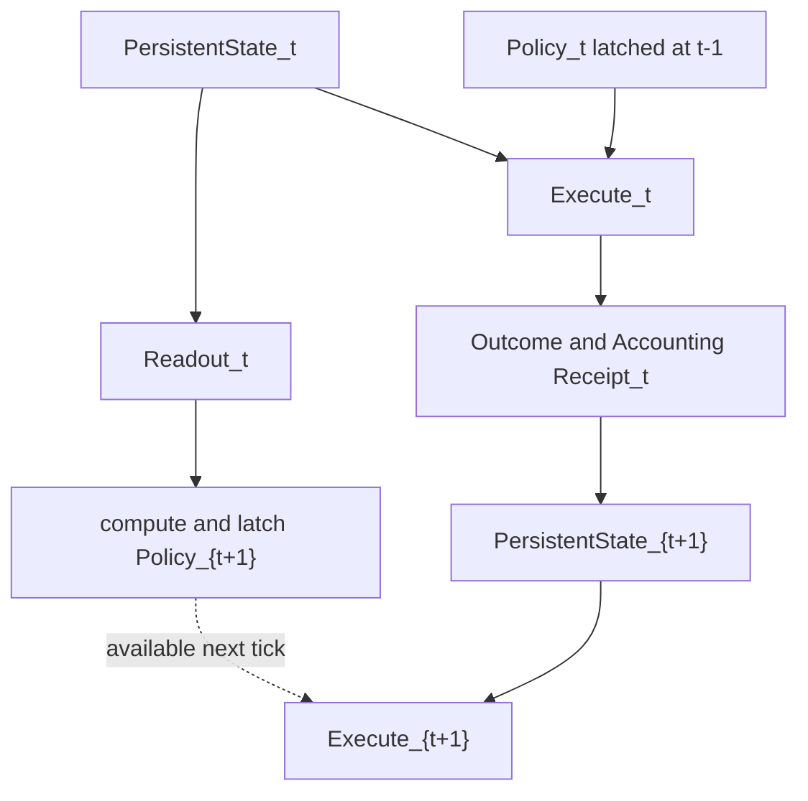
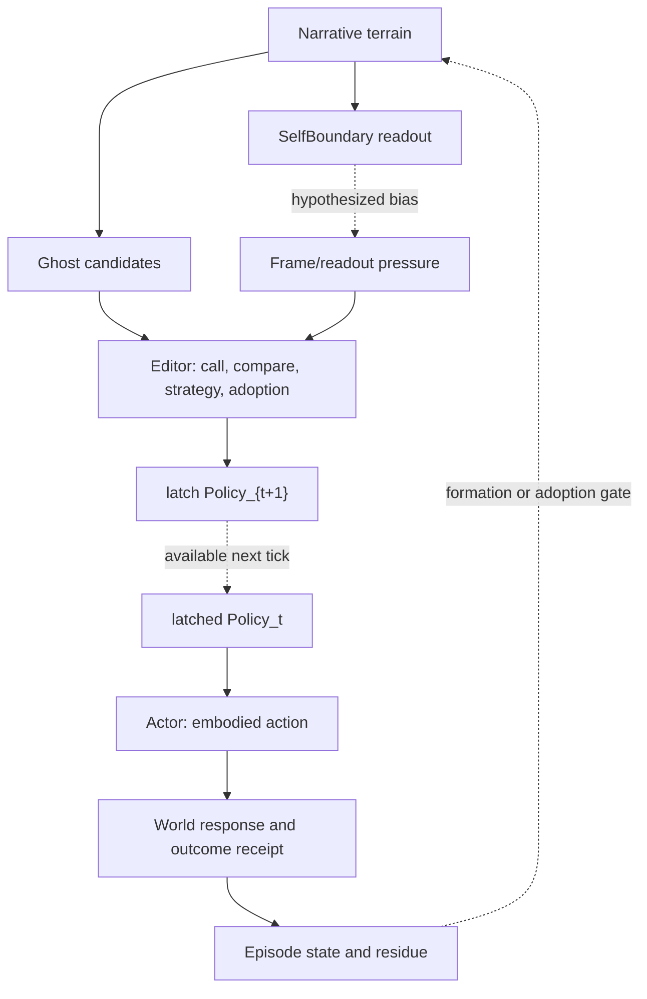

# Interchapter Note 04-A — 흐름을 견디는 경계

## 다음 박자·Ghost·자기 경계·서사 인력·생명 유지에 대한 결정 체크포인트

> **상태:** 연구 결정 메모 v1.0 · canon 아님  
> **작성 시점:** 2026-07-12  
> **직접 검토 기반:** Chapter 01–04, Interchapter Note 03-A  
> **목적:** Chapter 04의 통찰을 다음 통합 공장 지층으로 운반하되, 새 생명·자기 이론을 과거 원문에 소급하지 않기

---

## 0. 왜 여기서 멈춰 결정해야 하는가

Chapter 04는 readout의 권한을 되돌려주지 않으면서도, 그것이 미래의 노동에 실제 영향을 주는 길을 복원했다.

```text
읽힘 ≠ 현재 사실 쓰기
읽힘 → 다음 tick의 탐색·비교·편성에는 영향 가능
```

그러나 그 장의 종점인 X/R/U/A는 완성된 타입 시스템이 아니었다.

- X는 persistence와 authority를 섞었다.
- R과 A에는 MeaningFlux가 중복 거주했다.
- `CovState`는 지속하지만 집이 없었다.
- `U_{t+1}`와 현재 Execute/Spend의 clock convention이 닫히지 않았다.
- FrameGate·coverage는 현재 장면의 경계였지 정신적 자기 경계가 아니었다.
- Ghost·Editor·Actor·Outcome·Episode·Narrative의 전체 순환은 RATION 안에서 재결합되지 않았다 `[C4:L652–837, L956–999]`.

이 상태로 다음 통합 공장에 들어가면 두 위험이 있다.

1. 유용한 지연 제어 원리를 버릴 수 있다.
2. 미폐쇄된 X/R/U/A를 완성된 정본처럼 굳힐 수 있다.

따라서 이 메모는 Chapter 04를 다시 요약하지 않는다. **무엇을 승계하고, 무엇을 고쳐 들고 가며, 무엇을 아직 가설로만 보존할지** 결정한다.

---

## 1. 이 메모의 표지와 증거 규율

| 축 | 표지 | 의미 |
|---|---|---|
| 결정 | `[KEEP]` | 다음 장의 감사 기준으로 유지할 작업 원리 |
| 결정 | `[REVISE]` | 핵심 의도는 유지하되 타입·writer·clock을 고쳐야 함 |
| 결정 | `[HOLD]` | 유력하지만 후속 원문 검증 전 canon 승격 금지 |
| 결정 | `[REJECT-EQUIVALENCE]` | 두 개념을 같은 것으로 합치는 등식 금지 |
| provenance | `[SOURCE-BOUND]` | Chapter 01–04의 직접 복원 또는 03-A의 `[RECOVERED]` 범위. 03-A의 `[SYNTHESIS]/[BRIDGE]`는 포함하지 않음 |
| provenance | `[SYNTHESIS]` | 여러 장과 사용자 설명을 현재 작업 모델로 결합한 것 |
| provenance | `[BRIDGE]` | 생명·집단·LLM 등 더 먼 영역으로 뻗는 가설 |
| 질문 | `[OPEN]` | 다음 지층에서 확인해야 하는 질문 |
| 참조 | `[RECOVERED]` | 03-A에서 과거 원문에 직접 있었던 내용으로 판정한 표지 |
| 충돌 | `[REAL CONFLICT]` | 같은 역할·writer·clock으로 동시에 참일 수 없는 정의 충돌 |

결정축과 provenance축은 직교한다. 예를 들어 어떤 문장은 `[HOLD][BRIDGE]`일 수 있고, 후속 직접 근거가 발견되면 provenance만 `[SOURCE-BOUND]`로 바뀌며 결정 상태는 별도로 다시 판정한다.

```text
DecisionStatus = KEEP | REVISE | HOLD | REJECT-EQUIVALENCE
Provenance     = SOURCE-BOUND | SYNTHESIS | BRIDGE

DecisionStatus ≠ Provenance
```

시간 오염을 막기 위해 다음을 잠근다.

```text
Chapter 04의 RATION ≠ 완성된 생명 이론
coverage ≠ 정신적 자기 경계
FrameGate ≠ Editor 전체
가역 Ψ / 미래 초안 ≠ Ghost와의 직접 동일성
X/R/U/A ≠ 현행 typed architecture의 완성본
2026-07의 LLM 비유 ≠ 0105–0117 원문 주장
```

이 메모가 새로 제안하는 생명·자기 구조는 모두 `[SYNTHESIS]` 또는 `[BRIDGE]`다.

---

## 2. Decision Register — 다음 장에 무엇을 들고 갈 것인가

| ID | 판정 | 결정 |
|---|---|---|
| `D04-01` | `[KEEP]` | readout은 현재 authority를 쓰지 못하지만 다음 tick 작업을 편성할 수 있다 |
| `D04-02` | `[REVISE]` | 현재 `U_t` 실행과 미래 `U_{t+1}` latch를 두 lane으로 분리한다 |
| `D04-03` | `[REVISE]` | Residence와 Authority를 직교화한다. 지속한다고 권위가 생기지 않는다 |
| `D04-04` | `[REVISE]` | 정책이 주장하는 coverage·개선은 대응 work·cost receipt 없이 지속층에 쓰지 않는다. 외부 노출·수동 손상·자율 생체 update는 별도 writer·clock·outcome receipt로 갱신될 수 있다 |
| `D04-05` | `[REVISE]` | Accounting `A`는 Attention과 충돌하므로 `Acct/Receipt`로 분리한다 |
| `D04-06` | `[REVISE]` | MeaningFlux readout과 Episode 진행 receipt를 다른 타입으로 둔다 |
| `D04-07` | `[KEEP]` | No-discount는 수행 비용 삭제 금지이지 최대 출력 의무가 아니다 |
| `D04-08` | `[REJECT-EQUIVALENCE]` | Frame boundary와 self-boundary를 동일시하지 않는다 |
| `D04-09` | `[KEEP]` | Ghost 내용과 endorsement·intent·plan·action을 분리한다 |
| `D04-10` | `[REVISE]` | 기자·Editor·Author·Actor를 하나의 인격 모듈로 합치지 않고 scope별 역할로 나눈다 |
| `D04-11` | `[KEEP]` | 실제 경험이 Narrative 지형을 만들지만, formed-by와 endorsed-by를 분리한다 |
| `D04-12` | `[REJECT-EQUIVALENCE]` | Belonging·Stake·Responsibility·Identity가 높아도 타자에 대한 Authority는 자동 증가하지 않는다 |
| `D04-13` | `[HOLD]` | 생명을 ‘지연을 가진 선택적 투과 경계’로 보는 가설을 다음 생명 지층에서 검증한다 |
| `D04-14` | `[HOLD]` | 행복을 형태 보존적 flow quality의 readout으로 보되 생명의 목적함수로 승격하지 않는다 |
| `D04-15` | `[KEEP]` | `t_eng / t_bio / t_commit`의 timebase와 current/future transition lane을 서로 다른 문제로 감사한다 |
| `D04-16` | `[KEEP]` | FULL15 Story 9c의 add-only 후보 생성과 U17/R05의 좁은 next-tick shaping을 서로 다른 branch로 보존한다 |
| `D04-17` | `[REVISE]` | U17에는 공식 폐기·rollback 선언이 없다. 직접 확인되는 것은 Story 9c의 source omission과 aggregate-visible capability regression이며, semantic rollback이라는 표현은 합성 판정으로만 제한한다 |
| `D04-18` | `[REVISE]` | canonical `ΔQ⊥` 정의와 frame-boundary intrusion이라는 현상 해석을 동일식으로 만들지 않는다 |

`D04-16/17`의 근거는 FULL15의 add-only candidate branch와 U17의 더 좁은 source set·policy shaping 사이의 실제 차이다. 공식 migration·deprecation·rollback 선언은 없다. 직접 확인되는 것은 U17 단일 읽기 의미론에서의 source omission과 aggregate-visible capability regression이며, `semantic rollback`이라는 평가는 합성 표지 아래에서만 사용한다 `[C4:L903–915]`.

이 결정표의 중심은 네 줄로 압축된다.

```text
Influence ≠ Authority
Persistence ≠ Authority
Formation ≠ Endorsement
Internalization ≠ Jurisdiction
```

### 2.1 계보 등급

| 방향 | 현재 판정 | 소급 금지 |
|---|---|---|
| 지속적 흐름·가역 후보·선택적 비가역 편입·비용을 치르는 형태 유지 | `[SYNTHESIS] — 강한 교차챕터 합성` | Chapters 01–04의 한 문서가 이 완성식을 직접 선언했다고 쓰지 않음 |
| 위 문법을 생명의 일반 정의로 확장 | `[BRIDGE]` | `flow`, persistence, X/R/U/A 중 하나만으로 life를 판정하지 않음 |
| 정신적 자기 경계 | `[SYNTHESIS] — 강한 합성` | EOE·own%·Territory·Coverage 중 하나와 동일시하지 않음 |
| 현재 몸의 효용과 장기 저자적 자기 궤적의 충돌 | `[SOURCE-BOUND]` `[N03:L247–255]` | 모든 가족·혈연 희생의 원인으로 일반화하지 않음 |
| 좁은 Ghost의 후보 생성·비사실성·비권한성 | `[SOURCE-BOUND]` `[N03:L464–472]` | 후기 Ψ·JOT·LAB와 직접 동일시하지 않음 |
| 넓은 Ghost-space를 sandbox/cache로 읽기 | `[SYNTHESIS] — 강한 합성` `[N03:L474–499]` | 일상적 ‘자아’ 전체와 같다고 확정하지 않음 |
| Ghost를 내부화된 변이 루프로 읽기 | `[BRIDGE]` `[N03:L546–559]` | 진화생물학적 동일성으로 승격하지 않음 |

```text
flow ≠ life
persistent form ≠ life
X→R→U→A→X ≠ life

EOE Ownership ≠ own% ≠ self-boundary
Territory ≠ Coverage ≠ FrameGate ≠ self-boundary

Wave ≠ Ghost
Ghost ≠ Ψ/View/JOT ≠ ρ ≠ LAB
Narrative Field / geometry ≠ authority ledger

N03 [SYNTHESIS]/[BRIDGE] ≠ SOURCE-BOUND
C4 [BRIDGE] ≠ C4 recovered claim
04-A [SYNTHESIS]/[BRIDGE] ≠ next-chapter inherited doctrine
later resemblance ≠ direct lineage
forward corroboration ≠ retroactive origin
```

후속 문서에서 같은 문장이나 닮은 구조가 발견되어도 source 선언·역할·writer·clock이 확인되기 전에는 직접 계보로 승격하지 않는다.

---

## 3. 선택된 작업 아키텍처

### 3.1 Residence와 Authority를 다른 축으로 둔다

X/R/U/A의 통찰은 “어디에 사는가”를 먼저 묻는 것이었다. 문제는 X를 권한 상태라고 부르면서 지속값·배경장·리미터·operator를 함께 넣은 데 있었다 `[C4:L741–795]`.

> **[REVISE]** 다음 장에서는 residence category와 writer authority를 별도 축으로 둔다.

| 종류 | 질문 | 예시 |
|---|---|---|
| `PersistentState` | 다음 tick에 무엇이 보존되는가? | 몸 상태, 잠금, memory, CovState, Narrative source |
| `Readout` | state·receipt에서 무엇이 계산되어 보이는가? | qualia, pressure, MeaningFlux, Frame salience |
| `LatchedPolicy` | 다음 실행에서 어떤 운영 노브를 쓸 것인가? | scan 폭, 비교 예산, GateBias, Throttle |
| `Receipt/Accounting` | 실제로 무엇을 수행했고 어떤 결과·비용이 생겼는가? | Spend, heat delta, outcome, Episode progress |
| `AuthorityRelation` | 누가 어느 transition을 mint·write·commit할 수 있는가? | writer, gate, reviewer, consent, public rule |

```text
residence(value)
≠ authority(value)

authority
= actor × transition × scope × grounds의 관계
```

이 분리로 오래 남지만 권위가 없는 상태를 자연스럽게 둘 수 있다.

- 외상 residue는 지속할 수 있지만 승인된 자기 선언은 아니다.
- 사랑의 지형은 지속할 수 있지만 타인에 대한 관할권이 아니다.
- JOT trace의 지속만으로 fact·warrant가 성립하지 않는다. provenance·attestation을 거치면 evidence 절차의 입력은 될 수 있다.
- CovState는 다음 tick에 남을 수 있지만 Select writer는 아니다.

### 3.2 현재 실행 lane과 다음 정책 lane

Chapter 04의 surface pipeline은 `U_{t+1}`가 현재 `Spend_t`를 만드는 것처럼 읽힐 수 있었다. 작업 가설은 다음처럼 분리한다 `[C4:L797–829, L1127–1138]`.



핵심 규율은 다음이다.

```text
Readout_t → Policy_t 금지
Readout_t → latch Policy_{t+1} 허용

Execute_t는 Policy_t 사용
State_{t+1}은 실제 Receipt_t 뒤에만 갱신
```

지연은 influence 제거가 아니라 자기확증 차단이다. 다음 정책이 어떤 후보를 더 발견하게 했는지는 search provenance로 남겨야 한다.

이 두 lane은 두 개의 clock이 아니다. Chapter 04의 실제 timebase인 `t_eng`, `t_bio`, `t_commit`과 `CommitCheckTick ⊂ t_eng`는 별도 감사 축이다 `[C4:L868–879]`.

```text
transition lane : 한 tick에서 어떤 정책을 읽고 다음 정책을 언제 latch하는가
timebase        : 어떤 종류의 상태가 어느 시간 격자에서 갱신되는가

transition lane ≠ timebase
```

### 3.3 전체 순환 — 직렬 파이프라인이 아니라 비대칭 feedback loop

Interchapter Note 03-A는 Ghost–Editor–Actor–Episode–Narrative를 비대칭 순환으로 읽었다 `[N03:L403–430]`. Chapter 04는 그중 readout→future policy와 accounting 경로를 보강했다.

> **[SYNTHESIS]** 두 결과를 합친 현재 작업 루프는 다음과 같다.



이 루프는 다음 비대칭을 보존한다.

```text
Narrative → Ghost 후보 접근성을 굽힐 수 있음
Ghost candidate ↛ Narrative 자동 기입 불가

Editor strategy → Action proposal 가능
Action proposal ≠ world outcome

Outcome receipt → Episode 가능
Episode ≠ Narrative 자동 승격
```

### 3.4 하나의 인간 은유 대신 scope별 역할을 둔다

소설가 은유는 세계에 대한 저작권을 과장했고, 기자 은유는 자기 약속·행동의 제한된 저자성을 약화할 수 있었다. 어느 하나를 전체 인간으로 고정하지 않는다.

> **[SYNTHESIS]** 다음 표는 서로 다른 시대의 은유와 기능을 이 메모의 scope별 역할로 재배열한 것이며, 어느 원문의 단일 모듈 표가 아니다.

| 역할 | 허용 범위 | 갖지 못하는 권한 |
|---|---|---|
| `Reporter` | 세계·타인에 관해 자료를 찾고 현재 프레임을 구성 | 세계 사실을 창작하거나 타인을 대신 결정 |
| `Ghost` | 가역 후보·이미지·충동·시나리오를 발산 | endorsement·전략·행동의 자동 저자성 |
| `Editor` | 후보를 호출·비교·보류하고 전략과 배팅을 편성 | 외부 결과를 보장하거나 과거 사실을 재작성 |
| `Actor` | 몸과 세계에 실제 행동을 외부화 | 결과와 타자의 응답을 통제 |
| `Limited Author` | 자기 발화·약속·행동을 인수 | 세계 전체나 타인의 Narrative 저작권 |
| `Protagonist` | 통제하지 못한 결과까지 실제로 살아냄 | 모든 사건의 원인·책임을 자동 인수 |
| `Reader` | 지나간 Episode를 재해석하고 미래 의미를 갱신 | 과거 사건·피해·공적 책임의 소급 삭제 |

```text
Reporter of facts
Ghost of possibilities
Editor of strategy
Author of commitments
Actor of interventions
Protagonist of consequences
Reader of history
```

---

## 4. 자기 경계 — 현재 프레임보다 깊고 타자에 대한 권한보다 좁다

### 4.1 Frame boundary는 self-boundary가 아니다 — 출력면일 가능성은 보류한다

Chapter 04의 coverage는 이번 장면에서 의식이 도달해 처리할 수 있는 범위였다. 그것은 정체성·책임·관계의 장기 경계가 아니다 `[C4:L551–570, L1187–1197]`.

> **[REJECT-EQUIVALENCE]**

```text
Frame boundary
= 지금 무엇이 보이고 처리되는가

Self-boundary
= 누구의 미래·손상·연속성이 나의 유지에 포함되는가

Frame boundary ≠ Self-boundary
```

그러나 둘이 무관하다고 단정할 수도 없다.

> **[HOLD][BRIDGE]** 다음 결합은 가능한 작업 가설이다. Chapter 04에는 아직 이 경로의 writer·receipt·clock이 없다.

```text
Narrative terrain
→ SelfBoundaryReadout
→ (hypothesized) FrameGate bias
→ 다음 정책의 노동 배분
```

즉 FrameGate는 자기 경계가 현재 행동으로 표출되는 한 표면일 수 있지만, 자기 경계를 mint하지 않는다. 후속 문서가 실제 경로를 제공하기 전에는 이 화살표를 상속 계약으로 쓰지 않는다.

### 4.2 자기 경계의 여섯 readout 축

> **[SYNTHESIS]** §4.2–4.4는 03-A가 제안한 자기 경계 합성을 재사용한다. 초기 원문의 완성된 상태변수나 직접 계약이 아니다.

`own%` 하나를 확장할 때 다음 축을 사용하되, 사람과 관계를 미리 판정하는 독립 노브로 두지 않는다 `[N03:L343–368]`.

| 축 | 질문 | 자동 승격 금지 |
|---|---|---|
| `Belonging` | 같은 편·관계망으로 체험되는가? | 귀속감 ≠ 공동 계약 |
| `Stake` | 그 미래에 얼마를 걸었는가? | 큰 배팅 ≠ 옳음 |
| `Responsibility` | 그 손상을 내가 수리해야 한다고 느끼는가? | 죄책감 ≠ 실제 의무 전체 |
| `Authorship` | 그 행동과 결과를 내 사건으로 인수하는가? | 인수 ≠ 외부 사실의 증명 |
| `Identity` | 이것을 잃으면 자기 연속성이 무너지는가? | 제거비용 ≠ 건강한 사랑 |
| `Authority_felt` | 통제하거나 대신 결정할 권리가 있다고 느끼는가? | 느껴지는 권리 ≠ 정당한 관할권 |

> **[KEEP][SYNTHESIS]** 이 값들은 원인 노브보다 실제 Episode가 만든 Narrative 지형의 서로 다른 readout으로 둔다.

```text
실제 돌봄·손상·배신·수리·약속·몸의 흔적
→ Episode와 미청산 residue
→ Narrative geometry
→ 현재 self-boundary의 등고선
→ Belonging / Stake / Responsibility / Authorship / Identity readout
```

여기서 `Authority_felt`만 이 흐름의 readout이다. `Authority_valid`는 자동 산출하지 않으며 타자의 동의, 관계 계약, 공적 규칙, 증빙과 scope를 별도로 요구한다.

### 4.3 formed-by, endorsed-by, responsible-for를 분리한다

실제 경험은 자기 지형을 만든다. 그러나 나를 형성한 모든 것을 내가 승인한 것은 아니다. 외상·강요·중독·조건화도 후보 접근성, 비용, 경계감을 바꿀 수 있다 `[N03:L318–341]`.

```text
formed_by(x)       : x가 실제로 현재 지형을 만들었는가
felt_as_self(x)    : x가 내 일부처럼 체험되는가
endorsed_as_self(x): x를 내가 미래 자기로 인수하는가
responsible_for(x) : x에 대해 실제 수리·의무가 있는가
authorized_over(x) : x를 통제·대리할 권한이 있는가
```

```text
formed_by
≠ endorsed_as_self
≠ responsible_for
≠ authorized_over
```

이 구분은 자기 경계를 순수한 의지 선언으로 만들지도 않고, 반대로 모든 상처와 조건화를 승인된 정체성으로 만들지도 않는다.

### 4.4 자기 경계는 대상 목록이면서 미래 궤적의 경계다

정신적 자기 경계는 “누가 내 사람인가”의 목록만이 아니다. 어떤 행동 뒤의 미래를 계속 나의 삶으로 인수할 수 있는가를 제한한다 `[N03:L391–399]`.

```text
이 행동 뒤의 나는 여전히 내가 인수할 수 있는가?
이 관계를 버린 미래는 나의 연속성을 보존하는가?
현재 몸의 손실보다 보호하려는 장기 패턴이 더 중심적인가?
```

이 구조는 희생·대의·약속을 설명할 후보가 되지만, 어떤 명분도 개체 희생을 자동 정당화하지 않는다.

---

## 5. Ghost — 가역 후보가 사는 곳과 그것을 다루는 행위를 분리한다

### 5.1 넓은 Ghost-space와 좁은 Ghost-generator

Interchapter Note 03-A에서 직접 복원된 Ghost의 최소 기능은 가능성·가설·환상·시뮬레이션을 생성하되 사실성과 운영 권한을 보증하지 않는 것이었다. 사용자 보정은 이를 인간에게서 반응이 먼저 떠오르는 넓은 가상 작업공간, 즉 완충지대이자 speculative cache로 확장했다 `[N03:L462–499]`.

> **[REVISE]** 두 범위를 같은 모듈로 부르지 않는다.

| 구분 | 작업 정의 | 기본 권한 |
|---|---|---|
| `Ghost-space` | 이미지·충동·대사·사고실험·미래 장면이 잠시 사는 가역 작업공간 | candidate residence만 가짐 |
| `Ghost-generator` | 그 공간에 후보와 변이를 생성하는 좁은 기능 | 생성만 하며 선택하지 않음 |
| `Editor` | 후보를 호출·비교·반복·보류하고 전략을 제안 | proposal 가능, 현재 실행권 없음 |
| `Actor` | 이미 latch된 전략을 몸과 세계에 외부화 | 행위 가능, 결과 통제권 없음 |

```text
Story may condition candidates
≠ Ghost candidate is authored Story

Ghost-space contains a reaction
≠ Ghost-generator endorsed it
≠ Editor adopted it
```

Chapter 04의 가역 미래 초안과 RATION readout은 이 구조에 기능적으로 닿지만, `Ghost` 명칭·전략·rehearsal 계약을 직접 승계하지 않았다. 따라서 `Ghost → RATION`은 직접 계보가 아니라 기능적 유비만 허용한다 `[C4:L633, L995–996, L1046, L1061]`.

### 5.2 생성에서 장기 서사까지의 타입 문턱

> **[SYNTHESIS]** 최소한 다음 단계를 구별한다 `[N03:L501–528]`.

| 단계 | 뜻 | 기본 지위 |
|---|---|---|
| `SpontaneousCandidate` | 자동으로 떠오른 생각·이미지·충동 | 비저자적 후보 |
| `InvokedSimulation` | 특정 질문이나 장면을 의도적으로 다시 호출 | 호출 행위에만 저자성 가능 |
| `Rehearsal` | 후보를 반복·구체화하며 주의와 자원을 배치 | 학습·배팅 흔적 가능 |
| `Plan` | 현실 실행을 위해 순서·조건·자원을 결박 | 전략, 아직 행동 아님 |
| `Act` | 몸과 세계에 접촉한 실행 | action receipt와 외부 결과 가능 |
| `EpisodeIntegration` | 노출·행동·결과·미청산을 사건으로 묶음 | authored Narrative와 여전히 다름 |

```text
Generation
≠ Authorship
≠ Strategy
≠ Action
≠ Outcome
≠ Narrative incorporation
```

이 분리는 양방향 봉인이다.

- 자발적 후보를 그 사람의 의도나 정체성으로 유죄화하지 않는다.
- 의도적 호출·반복·계획·행동을 모두 “그냥 떠오른 생각”으로 세탁하지 않는다.

### 5.3 비원장이라고 무비용은 아니다

Ghost 후보의 **내용**이 장기 Narrative 지형에 자동 편입되지 않는 것과, 그 후보를 생성·호출·반복한 과정이 아무 흔적도 남기지 않는 것은 다르다 `[N03:L523–544]`.

```text
Ghost.content
  기본적으로 가역·비저장 후보

Ghost.compute_cost
  실제로 사용한 시간·주의·몸 비용

Editor.call_trace
  의도적 호출·반복·비교·배팅의 흔적

Episode.residue
  실제 노출·행동·결과 뒤에 남은 미청산 영향

Narrative.write
  별도 편입 문턱을 지난 장기 지형 갱신
```

> **[HOLD]** Ghost 전체를 X·R·U 중 한 residence에 넣지 않는다. 후보 내용, 계산 비용, 호출 흔적, Episode 잔류가 서로 다른 writer와 보존 시간을 가질 수 있기 때문이다.

### 5.4 최소 typed sketch

다음은 원문 복원이 아니라 후속 통합 문서를 감사하기 위한 **[BRIDGE] — MINIMAL TYPED SKETCH**다.

```text
GhostCandidate {
  content,
  spontaneous_or_invoked,
  default_residence = ephemeral
}

EditorReceipt {
  inspected_candidates,
  simulation_calls,
  rehearsal,
  adopted_strategy?,
  policy_proposal?
}

ActionReceipt {
  latched_policy_id,
  expressed_action,
  body_cost
}

OutcomeReceipt {
  action_id,
  observed_world_result,
  attester
}

EpisodeRecord {
  exposure,
  action?,
  outcome?,
  authorship_degree,
  unsettled_residue,
  relationship_refs
}
```

```text
GhostCandidate ↛ Narrative 자동 write
Editor adoption → 전략 저자성 가능
Action + Outcome → Episode 재료
Episode ↛ authored Narrative 자동 승격
```

---

## 6. 생명으로 향하는 Bridge — 흐름을 막는 벽이 아니라 편입을 늦추는 경계

### 6.1 생명은 정지가 아니라 제어된 변화로 형태를 유지한다

> **[BRIDGE]** 생명을 우주의 변화 흐름 속에서 흩어지지 않고 형태를 유지하는 존재로 본다면, 그 경계의 핵심 기능은 외부 변화를 전부 차단하는 데 있지 않다. **변화가 곧바로 자신을 덮어쓰지 못하게 늦추고, 시험하고, 일부만 비용·결과·수리를 거쳐 편입하는 데** 있다.

```text
외부 변화
→ 선택적 감지와 readout
→ 가역 후보·내부 시뮬레이션
→ 지연된 전략 latch
→ 몸을 통한 현실 시험
→ outcome/accounting receipt
→ 제한된 state·Episode·Narrative 편입
```

이 가설 아래 생명의 경계는 고정된 벽보다 **지연을 가진 선택적 투과막**에 가깝다.

```text
모든 것을 막음 → 학습·적응 불가
모든 것을 즉시 편입 → 정체성·형태 붕괴
선별적으로 늦춰 편입 → 변화 속 형태 유지 가능
```

Chapter 04가 직접 보증하는 것은 readout과 다음 정책 사이의 지연 제어까지다. 이것을 생명의 일반 원리로 확장하는 일은 후속 생명 지층의 물리적·발생적 증거를 기다려야 한다.

### 6.2 자기 경계는 막의 정신적 등고선일 수 있다

> **[BRIDGE]** 정신적 자기 경계는 이 선택적 투과 원리가 관계·정체성·책임의 층에서 나타난 형태일 수 있다.

무엇이 경계 안에 있다는 말은 다음 중 하나 이상을 뜻할 수 있다.

- 그 손상이 나의 손실 함수에 들어온다.
- 그 미래에 나의 자원과 시간을 건다.
- 그 결과를 내 Episode로 인수하고 felt responsibility 또는 별도 repair commitment를 형성할 수 있다.
- 그것을 잃으면 나의 연속성이 크게 바뀐다.

그러나 어느 경우에도 타자에 대한 통제권은 자동 생성되지 않는다.

```text
SelfBoundaryReadout = {
  felt_belonging,
  stake,
  felt_responsibility,
  identity_dependency,
  loss_sensitivity
}

LegitimateAuthority =
  AuthorityFn(consent, role, contract, public_rule, current_capacity)
```

```text
SelfBoundaryReadout ↛ AuthorityGrant over another
```

### 6.3 Extended Self, Coupled Selves, Collective Self

한 사람이 가족을 자기 유지 범위에 넣는 것과 가족 전체가 하나의 상위 생명 단위가 되는 것은 다르다 `[N03:L683–701]`.

| 유형 | 최소 의미 | 아직 요구되는 것 |
|---|---|---|
| `Extended Self` | 한 개체가 외부 사람·가치·관계를 자기 유지 범위에 포함 | 일방적 felt inclusion일 수 있으나 mutual relation·authority는 아님 |
| `Coupled Selves` | 여러 개체가 서로의 상태를 유지 비용·수리 루프에 포함 | 상호성, 의존 경로, 갈등·이탈 규칙 |
| `Collective Self` | 구성원이 바뀌어도 공동 경계·기억·수리·갱신 규칙이 지속 | 공동 writer, 사건 기록, 멤버십, 자원 회계, 교체 내성 |

> **[HOLD]** 가족 희생이나 집단 행동 하나만으로 collective life를 선언하지 않는다. 개체 손실이 상위 패턴 보존으로 설명된다고 해서 그 희생이 자유롭거나 정당하거나 최선이라는 결론도 나오지 않는다.

### 6.4 행복은 목적함수보다 flow readout 후보로 둔다

Chapter 04는 행복을 단순한 상태 높이보다 지출이 방향·의미유량으로 남고 누수와 동요가 낮은 flow quality로 읽었다 `[C4:L573–610]`.

> **[HOLD][BRIDGE]** 이를 생명의 최종 목적함수로 올리지 않는다. 현재로서는 다음 관계의 체험적 readout 후보로만 보존한다.

```text
유입을 감당할 수 있음
+ Ghost에서 선택지가 살아 있음
+ Editor가 자기 경계와 맞는 경로를 찾을 수 있음
+ 행동 비용과 회복이 감당 가능함
+ 결과가 Narrative를 완전히 파괴하지 않음
→ 형태 보존적 flow가 좋다고 느껴질 가능성
```

고통 속에서도 가치 있는 흐름이 있을 수 있고, 쾌감이 장기 형태를 무너뜨릴 수도 있다. 따라서 `happiness = viability`나 `happiness = moral good`은 금지한다.

---

## 7. 회귀 시험 — 새 모델이 다시 뭉개면 안 되는 사례들

| 사례 | 반드시 보존할 분리 | 금지되는 추론 |
|---|---|---|
| 가족·집단을 위한 희생 | 높은 Belonging·Stake·Responsibility·Identity와 제한된 Authority | `inside self-boundary ⇒ 타자에 대한 관할권` |
| 흉악범 양부모 | 범죄, 최초 동기, 실제 돌봄, 공유 기억, 아이의 해석, 공적 책임 | `care ⇒ 범죄 소거`, `care received ⇒ 용서 의무` |
| 극단적 폭력 사고 | 자발 후보, 의도적 호출, rehearsal, plan, act, outcome | `생각 내용 ⇒ 의도·행동`, `행동 없음 ⇒ 모든 흔적 0` |
| Frame surprise | coverage 변화와 장기 self-boundary 변화 | `프레임에 들어옴 ⇒ 나의 일부가 됨` |
| LLM 비유 | 조건부 생성과 살아온 Narrative·내재적 stake·몸·outcome loop | `generated response ⇒ organismic Ghost 또는 자아` |

### 7.1 흉악범 양부모 사례

다음 재료는 하나가 다른 하나를 지우지 않은 채 함께 남아야 한다 `[N03:L600–660]`.

```text
범죄가 실제로 있었다.
속죄가 입양의 최초 동기였을 수 있다.
오랜 돌봄과 공유 Episode도 실제로 있었다.
그 과정의 애착과 동기는 시간이 지나며 달라졌을 수 있다.
아이는 그 관계로 인해 현재의 자신이 되었다.
아이는 동시에 도구화되었다는 배신감을 느낄 수 있다.
아이의 감사·애착·배신감은 용서나 관계 유지 의무를 만들지 않는다.
양육은 범죄 피해자에 대한 공적 책임을 대신 청산하지 않는다.
```

같은 사실을 알더라도 이미 살아온 Episode와 Narrative 지형이 다르면 가능한 미래의 비용도 달라진다. 이것은 “아무 해석이나 가능하다”는 말이 아니다. 사실은 해석의 feasible set을 제한하지만 하나의 의미와 관계 선택까지 자동 결정하지는 않는다.

```text
Shared Episode ≠ Shared Narrative ≠ Shared Authority
Care received ≠ duty to forgive
Reframing ≠ retroactive washing
```

### 7.2 가족 희생 사례

```text
felt responsibility ≠ objective duty
sacrifice ≠ free consent
sacrifice ≠ morally optimal
higher pattern preserved ≠ bodily loss discounted
```

자기 경계가 몸보다 넓다는 설명은 희생이 어떻게 가능해지는지 해명할 수 있다. 그것은 누구에게 희생을 요구해도 된다는 규범을 발급하지 않는다.

### 7.3 극단적 사고 사례

```text
GhostCandidate("kill") ↛ endorsement or intent
spontaneous thought ↛ authored Episode
rehearsal ↛ action
plan ↛ world outcome
no Narrative write ↛ no compute cost or trace
```

위험 평가가 필요한 구체적 준비·수단·임박성과 추상적인 사고실험을 같은 타입으로 두지 않는다. 동시에 실제 계획을 단순 후보로 축소하지 않는다.

### 7.4 LLM 대조의 제한

LLM 비유는 Ghost를 이해하기 위한 제한된 대조일 뿐 의식 판정이 아니다 `[N03:L705–734]`.

```text
generated response ↛ organismic Ghost
context or memory ↛ lived Episode or Narrative
external orchestrator ↛ intrinsic self-boundary
tool success ↛ attested outcome
preference text ↛ endogenous stake or AuthorityGrant
```

조건부 생성, 외부 메모리, 정책 필터, 도구 실행을 조합하면 일부 기능적 위치를 흉내 낼 수 있다. 그러나 그것만으로 자기 유지 경계, 몸의 비용, 결과를 살아내는 ledger, 타자와의 수리 관계가 생겼다고 결론 내리지 않는다.

---

## 8. 다음 통합 공장 지층을 읽을 감사 카드

다음 챕터는 아래 질문에 답하는 방식으로 읽는다. 원문이 답하지 않으면 결손을 결손으로 남긴다.

### A. residence와 authority

1. 지속하는 값마다 writer·update clock·scope가 지정되는가?
2. `PersistentState`, `Readout`, `Policy`, `Receipt`, `AuthorityGrant`가 타입으로 갈리는가?
3. 오래 남음·강하게 느껴짐·회계됨에서 truth나 authority를 추론하는가?

### B. transition lane과 timebase

4. 현재 실행은 이미 latch된 `Policy_t`를 쓰는가?
5. 새 readout은 `Policy_{t+1}`에만 영향을 주는가?
6. `t_eng / t_bio / t_commit` 같은 timebase와 current/future transition lane을 혼동하지 않는가?
7. `CommitCheckTick`이 별도 시간인지, 한 timebase의 부분 격자인지 명시하는가?

### C. Ghost·Editor·Actor

8. 후보 생성, 의도적 호출, 전략 채택, 실행, 결과가 분리되는가?
9. Ghost 내용의 비원장성과 계산 비용·호출 trace를 함께 표현할 수 있는가?
10. Editor proposal이 current action으로 same-tick 침투하지 않는가?
11. Actor의 action receipt와 world outcome receipt가 분리되는가?

### D. Episode·Narrative·자기 경계

12. 노출·행동·결과·저자성·미청산을 한 덩어리로 뭉개지 않는가?
13. Episode가 Narrative로 편입되는 별도 gate와 writer가 있는가?
14. `formed_by / felt_as_self / endorsed_as_self / responsible_for / authorized_over`를 분리할 수 있는가?
15. self-boundary readout이 타자에 대한 AuthorityGrant로 자동 승격되는가?

### E. 계보와 누락

16. Story 9c의 add-only 후보 생성과 RATION의 next-tick shaping 중 무엇을 실제 채택하는가?
17. UL·IE15 같은 비채택 branch를 공식 폐기로 오인하지 않는가?
18. Story 9c의 source omission이 반복되는가, 아니면 capability가 명시적으로 복구되는가?
19. `CovState`와 `MeaningFlux`의 residence·writer가 정해지는가?

### F. 생명 Bridge

20. 물리적 경계와 정신적 self-boundary를 직접 동일시하는가, 연결 조건을 제시하는가?
21. 생명의 형태 유지에 endogenous stake, 몸의 accounting, repair, reproduction 중 무엇이 요구되는가?
22. Extended Self, Coupled Selves, Collective Self를 구별하는가?
23. 집단 패턴 보존에서 개체 희생의 정당성을 몰래 도출하는가?

---

## 9. 운반용 최소 계약

### 9.1 채택할 typed skeleton

> **[SYNTHESIS] — AUDIT MODEL, CANON 아님**

```text
PersistentState<T> {
  value,
  version,
  update_clock,
  writer_rule
}

Readout<T> {
  derived_from,
  value,
  observed_at
}

AuthorityGrant {
  subject,
  transition_type,
  scope,
  grounds,
  expiry
}

Receipt {
  id,
  type,
  inputs,
  producer,
  occurred_at,
  provenance
}

PolicyLatch {
  policy,
  derived_from_readouts,
  valid_from_tick
}
```

```text
Persistent(x) ≠ Authorized(x)
Readout(x) ≠ Evidence(x) ≠ Warrant(x)
Receipt(x) ≠ AuthorityGrant(x)
Accounting(x) ≠ Truth(x)
```

이 비동일식은 영구적 사용 금지가 아니라 자동 승격 금지다. provenance·attestation·scope 검사를 거친 Readout이나 Receipt가 별도 evidence-mint 절차의 입력이 되는 것은 가능하지만, 자기 타입만으로 Evidence·Warrant·Authority가 되지는 않는다.

### 9.2 두 transition lane

```text
future-policy lane:
PersistentState_t + Receipts_≤t
→ Readout_t
→ PolicyProposal_t
→ latch Policy_{t+1}

optional human-runtime input [BRIDGE]:
Readout_t + GhostCandidates_t
→ EditorProposal_t
→ PolicyProposal_t

current-execution lane:
PersistentState_t + latched Policy_t
→ Actor_t / BodyVeto_t
→ ActionReceipt_t
→ World
→ OutcomeReceipt_t
→ AccountingReceipt_t
→ authorized Update
→ PersistentState_{t+1}
```

이것을 ‘두 clock’이라고 부르지 않는다. 실제 시간축 감사와 제어 transition 순서를 구별한다.

### 9.3 최종 금지 등식

```text
Residence ≠ Authority
Frame boundary ≠ Self-boundary
Generation ≠ Authorship ≠ Strategy ≠ Action ≠ Outcome
Exposure ≠ Endorsement
Formation ≠ Endorsement
Internalization ≠ Jurisdiction
Shared Episode ≠ Shared Narrative ≠ Shared Authority
Sacrifice ≠ Consent ≠ Moral optimality
```

---

## 10. 이 체크포인트가 잠그는 현재의 문장

### 10.1 현행 작업 정의

> **[SYNTHESIS]** 자기는 사물의 목록이라기보다, 무엇을 늦추고 무엇을 상상하며 무엇을 행동으로 인수하고 어떤 비용과 결과를 자기 역사에 편입할지를 반복해서 가르는 시간적 경계 패턴이다.

### 10.2 생명으로의 전방 가설

> **[BRIDGE]** 생명은 흐름을 막아서 형태를 유지하는 것이 아니라, 변화가 자신을 즉시 덮어쓰지 못하게 하고 일부만 가역 탐색·현실 시험·비용·결과·수리를 거쳐 편입함으로써 변화 속에서 형태를 지속하는 존재일 수 있다.

이 두 문장은 다음 장의 결론이 아니다. 다음 지층이 견뎌야 할 반례와 감사 기준이다.

---

## Appendix A. 출처 별칭

| 별칭 | 문서 |
|---|---|
| `C4` | `chapter-04-next-tick-influence-0115-0117.md` |
| `N03` | `interchapter-note-03a-self-boundary-ghost-editor-episode.md` |

이 메모는 두 문서의 판정과 2026-07-12 사용자 보정을 재배열한 결정 문서다. 인용 범위가 없는 `[SYNTHESIS]`와 `[BRIDGE]` 문장은 이 메모에서 새로 결합한 작업 가설이며 과거 원문의 직접 주장으로 인용하면 안 된다.

## Appendix B. 다음 갱신 규칙

다음 챕터를 읽은 뒤 이 메모는 다음 방식으로만 갱신한다.

1. 같은 scope·role·writer·clock을 가진 직접 계약이 발견되면 **그와 일치하는 절만** provenance를 `[SOURCE-BOUND]`로 갱신하고 원문 위치를 붙인다. 더 넓은 `[BRIDGE]/[SYNTHESIS]`는 남긴다. 결정축의 `[HOLD]`는 별도로 `[KEEP]` 또는 `[REVISE]` 재판정한다.
2. 반례가 나오면 문장을 삭제하기보다 `[REVISE]` 또는 `[REAL CONFLICT]`로 남긴다.
3. 후대 정본이 같은 말을 하더라도 초기 원문에 소급하지 않는다.
4. 생명·집단·LLM Bridge는 각각의 전용 챕터가 열리기 전까지 canon으로 병합하지 않는다.
5. Ghost 후보의 자유와 실제 호출·전략·행동의 책임을 어느 한쪽으로 압축하지 않는다.
